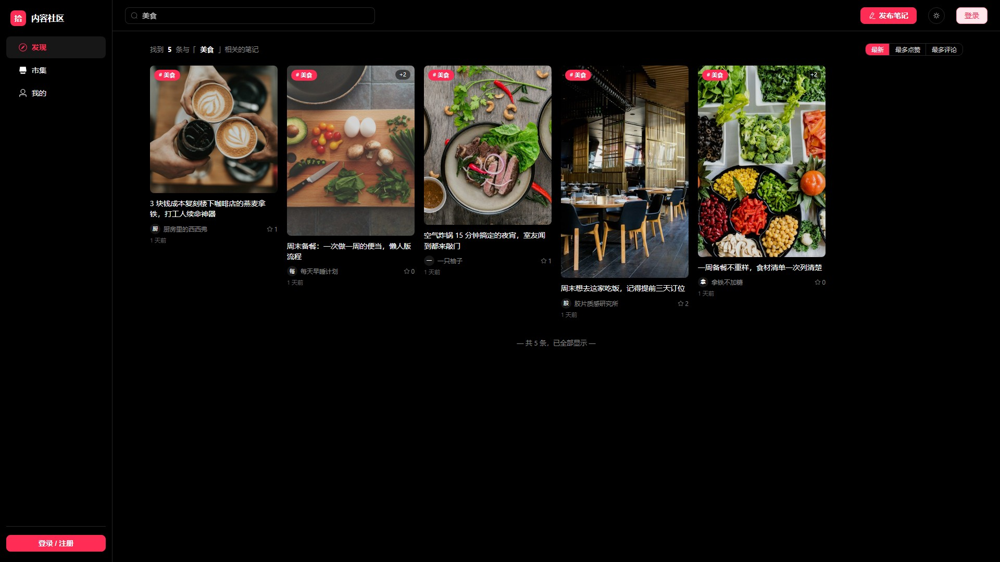
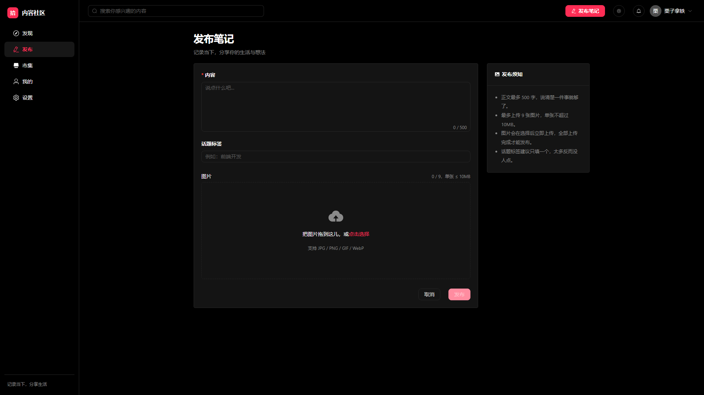
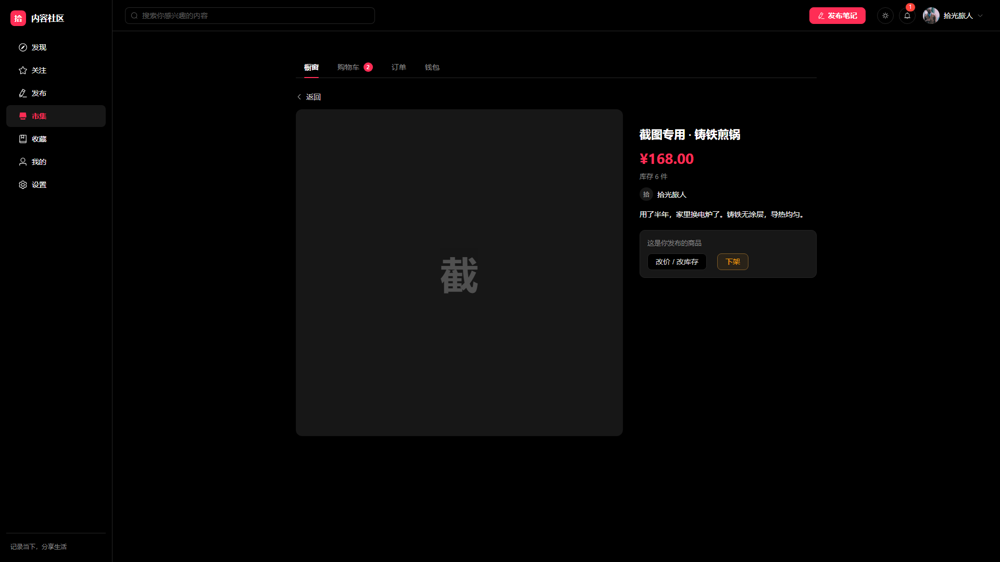
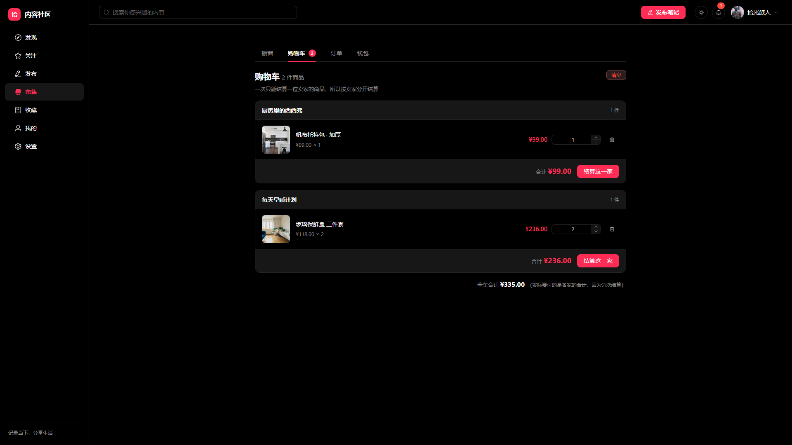
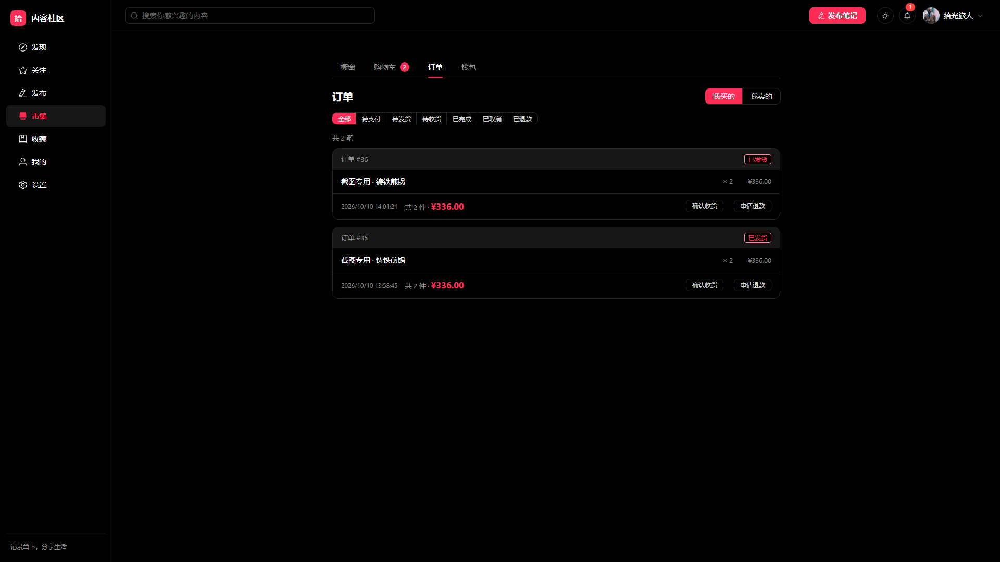
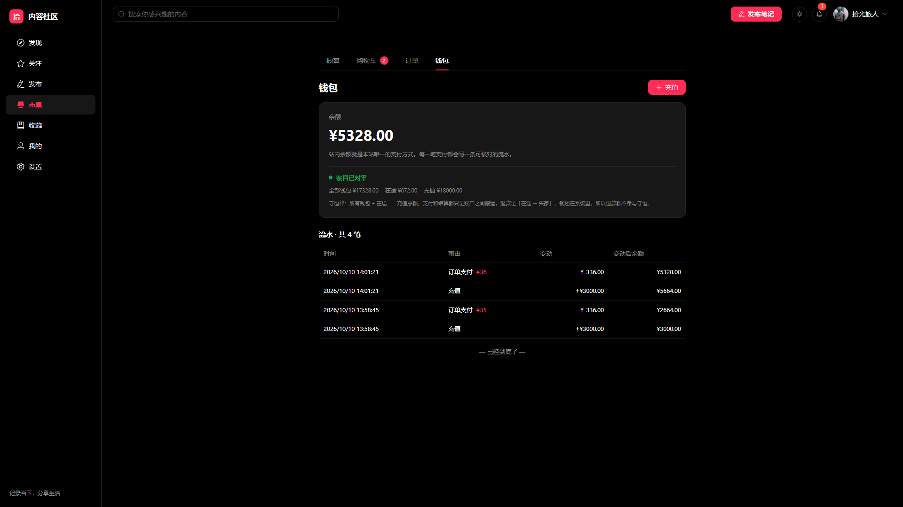
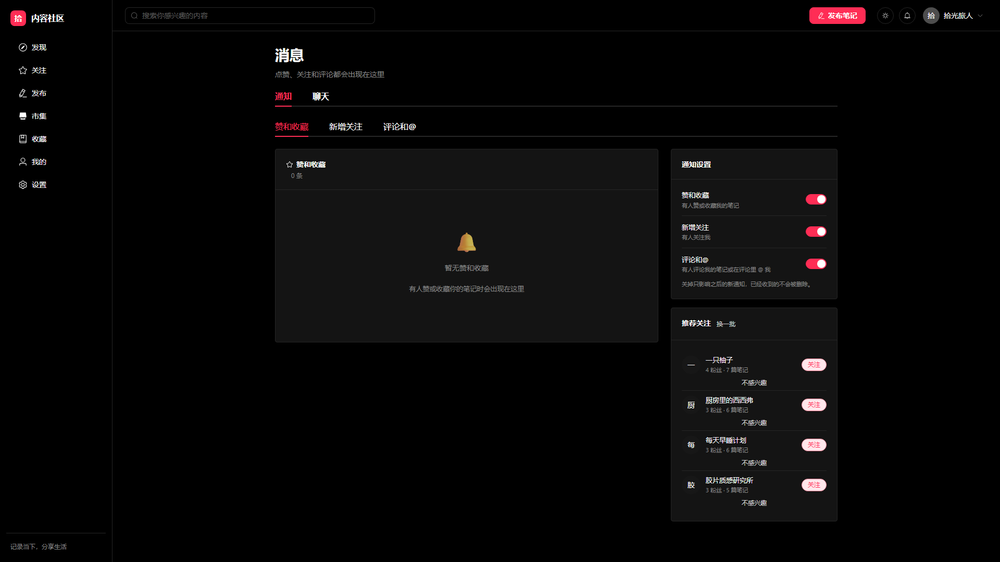
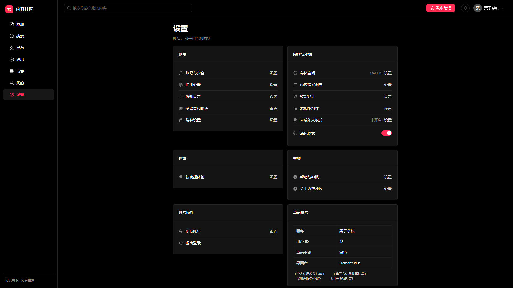
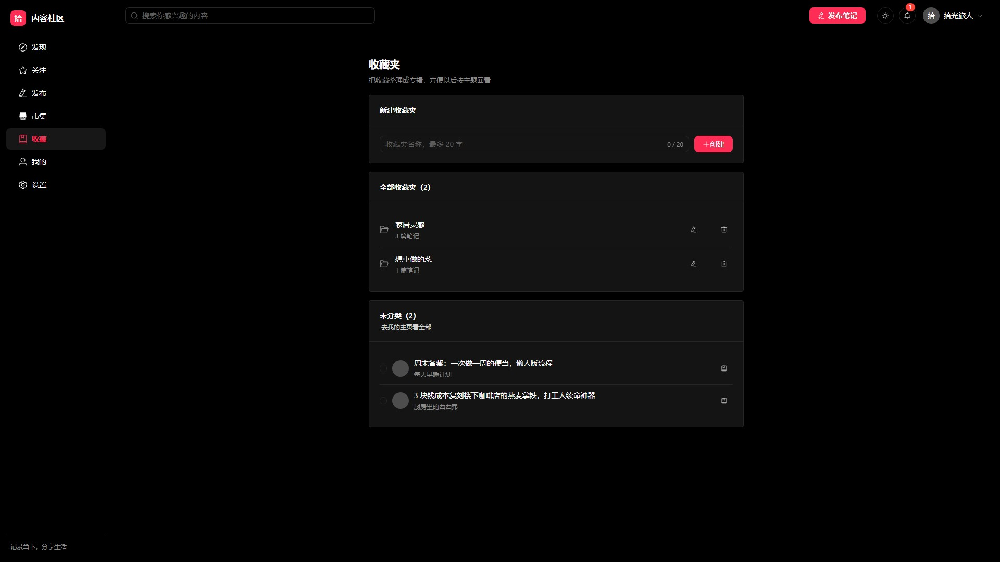
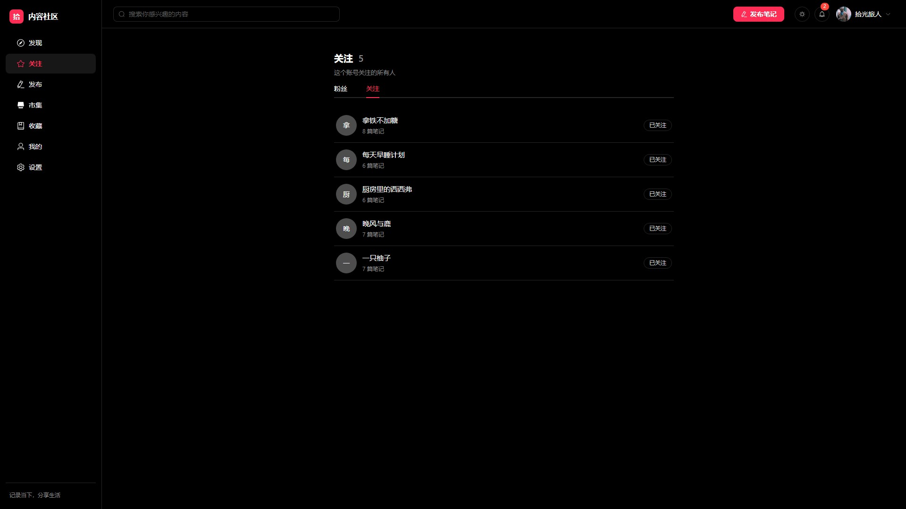

# 内容社区 (Content Sharing Platform)

一个仿小红书 UI/UX 的全栈内容社区前端 + 后端项目。**PC 桌面端**布局，组件层使用 Element Plus（完全接管其主题变量），后端零外部框架、本地 SQLite 存储、ORM 层手写 SQL。目标是展示一个完整的前后端分离项目的工程能力。

[](https://github.com/Liao-wenxuan/content-sharing-platform/actions/workflows/ci.yml)
[](LICENSE)


## ✨ 已实现功能

| 模块     | 功能                                                                                                                                                                                                                                                                                                                                                                                                                                                                          |
| -------- | ----------------------------------------------------------------------------------------------------------------------------------------------------------------------------------------------------------------------------------------------------------------------------------------------------------------------------------------------------------------------------------------------------------------------------------------------------------------------------- |
| 账号     | 注册 / 登录 / JWT 鉴权 / 自动登录态持久化 (Pinia + localStorage)                                                                                                                                                                                                                                                                                                                                                                                                              |
| 内容     | 发布笔记 (文本 + 1~9 张图，带逐图上传进度条) / 真瀑布流 feed / 笔记详情 / 图片灯箱预览                                                                                                                                                                                                                                                                                                                                                                                        |
| 推荐流   | **首页「推荐」频道是个性化排序，不是时间倒序**：分数 = 兴趣匹配 + 作者匹配 + 新鲜度（48h 半衰期）+ 热度（log 压缩防爆款霸屏）+ 关注加成 − 自推惩罚。画像从点赞/收藏/评论/关注/浏览**实时算**（30 天半衰期，收藏 3 > 评论 2 > 关注 1.5 > 点赞 1 > 浏览 0.2）；每条带**推荐理由**（「你常看「美食」」「你关注了这位作者」），hover 卡片有**不感兴趣**，兴趣画像页能看到权重条并**撤销屏蔽**。**排序冻结成快照**再翻页 —— 动态排序下 offset 分页必然同时漏一条重一条，游标也会漂 |
| 搜索     | 顶栏输入即出「笔记 / 话题 / 用户」三类候选 + 热门话题占位 + ↑↓/Enter/Esc 键盘导航；结果页支持三路匹配、<br>最新·最多点赞·最多评论排序、命中高亮、搜索历史（去重置顶 / 单删 / 清空）                                                                                                                                                                                                                                                                                           |
| 关注     | 关注 / 取关（幂等）+ 粉丝与关注列表（分页，每行自带 isFollowing）+ 互相关注标记 + 推荐关注（按影响力排序，可换一批）+ 关注流（只含订阅内容，与推荐流分入口）; 建议注意图不重复                                                                                                                                                                                                                                                                                                |
| 收藏     | 收藏 / 取消收藏（幂等）+ **多收藏夹**（建 / 改名 / 删；删夹不删内容，只退回未分类）+ 未分类显式可见 + 批量移入夹（整批一个事务）+ 主页「收藏」tab 按夹筛选；收藏是私密的，他人主页只显示私密占位                                                                                                                                                                                                                                                                              |
| 互动     | 点赞 (可选登录态) / 收藏 (登录态) / 评论列表 + **评论增强**：二级回复（只支持两级，跨笔记回复会被拒）+ 评论点赞 + **作者置顶**（只有笔记作者能置顶自己写的评论 —— 规则本身保证一条笔记最多一条置顶，不需要唯一约束）+ 置顶标记 + 回复默认展开可收起                                                                                                                                                                                                                           |
| 评论排序 | 后端 `ORDER BY (pinned_at IS NOT NULL) DESC, pinned_at DESC, created_at ASC`；前端 `sortComments` 保持同一条规则 —— 两边不一致的话，用户点一下置顶、刷新一下顺序就变了                                                                                                                                                                                                                                                                                                        |
| 浏览记录 | 进详情页自动记一笔（**fire-and-forget，失败不打扰用户**）；重复看同一篇不产生第二条而是顶到最前；**限长 200 条在写入时顺手剪掉超出部分**（表里的量始终有界，不是读取时截断）；`viewed_at` 用**毫秒**而不是默认的秒级 —— 连续点开两篇会落在同一秒，而"保留最新 N 条"必须能分出先后，同一秒排序不确定就变成随机删几条；只给「清空」不给「删某一条」，因为用户对这个功能的真实诉求几乎总是"我不想让别人看到我都看了什么"                                                         |
| 个人主页 | 封面 banner / 头像 / 三栏统计 / 4 个 tab + 公开/私密/合集筛选 / ElDialog 编辑资料 / 推荐关注；「常用功能」里**没有假按钮** —— 曾经「发布新笔记」点了提示"即将上线"，而发布流程早就做完了                                                                                                                                                                                                                                                                                      |
| 话题     | `/topic/:tag` 话题页：封面 + 笔记数 + 参与人数 + 相关话题（按「同话题作者的其它话题」推）+ 瀑布流；**不建 topics 表**，话题是 `posts.topic_tag` 的现算聚合视图，零维护、不可能有空壳话题；话题精确匹配（搜索联想才模糊）；三处入口全通：笔记详情标签 / 搜索建议 / 发布页热门话题一键填                                                                                                                                                                                        |
| 通知     | 五个来源（赞 / 收藏 / 关注 / 评论 / @提及）落一张可回溯的流水；**同一组合只保留一条**（重复互动浮到顶部并重新点亮，而不是刷屏）；未读数靠 **WS 帧实时更新**（别人点赞的那一刻铃铛就 +1，不用轮询）；三个分类可分别「全部已读」+ **按分类的通知开关**（关掉只影响之后的新通知，历史不删）；笔记被删后通知仍在，显示「原笔记已删除」                                                                                                                                            |
| 消息     | 两个顶层 Tab：通知（真实后端，见上一行）+ **实时聊天**（WebSocket 1v1：会话列表 / 历史分页 / 未读红点 / 已读回执 / 正在输入 / 多端同步 / 断线重连补发）；顶栏铃铛显示**聊天 + 通知**的合并未读                                                                                                                                                                                                                                                                                |
| 市集     | 完整 C2C 交易链路：商品橱窗（搜索 / 三种排序 / 翻页 / **发布商品**）/ 商品详情（**卖家视角**改价改库存上下架，买家视角加购直购）/ **购物车按卖家分组**结算 / **站内余额支付**（真的条件扣减 + 账本流水）/ 订单（我买的我卖的两个 tab，付款发货收货退款）/ 钱包（余额 + 可核对的流水 + 充值）。金额**全程整数分**，订单行是快照，库存用条件 UPDATE 防超卖，钱包有 `CHECK (balance >= 0)` 兜底                                                                                  |
| 支付     | 站内余额支付（真实现），微信 / 支付宝**置灰标注「未接入」而不是假装能点** —— 做成可点的话点了只能弹一句「模拟成功」，那比没有更糟。结算框里会列出三种方式和各自状态，让讨论有落点                                                                                                                                                                                                                                                                                             |
| 交易规则 | 一笔订单只能一个卖家的商品（闲鱼式 C2C 约束，发货权限因此天然清晰）；加购**不占库存**（那是预留问题，需要超时释放），下单才占用；改数量传**绝对值**（传增量的话请求重试一次就多买一件）；PATCH 改不存在的商品 → 404，DELETE 不存在的 → 200（"改成 N"需要知道失败，"确保它不在"应当幂等）                                                                                                                                                                                      |
| 资金流   | **在途资金**：买家付款 → 钱进平台在途（不是直接给卖家）→ 买家确认收货 → 结算给卖家；退款则是「在途 → 买家」原路退回。**守恒律：所有钱包余额 + 在途余额 == 充值总额**，钱包页和 `GET /api/wallet/audit` 都能当场查。少了在途这一层，退款就得从卖家账里扣，而卖家可能已经把它花掉了                                                                                                                                                                                             |
| 布局     | 桌面三栏：左侧固定 ElMenu（发现 / 发布 / 市集 / 我的 / 设置）+ 顶部栏（搜索 / 发布 / 主题 / 消息铃铛 / 用户菜单）+ 内容区；登录页走独立全屏                                                                                                                                                                                                                                                                                                                                   |
| 首页频道 | 12 个内容频道用 ElTabs 平铺一行（推荐 / 穿搭 / 美食 / 彩妆 / 影视 / 职场 / 情感 / 家居 / 游戏 / 旅行 / 健身 / 视频），选中态为居中红色短条                                                                                                                                                                                                                                                                                                                                    |
| 设置     | 5 组设置项卡片 + 深色模式 ElSwitch + 账号摘要 + 退出登录 + 协议链接                                                                                                                                                                                                                                                                                                                                                                                                           |
| 动效     | 五档时长 + 缓动字典 + CSS 原生弹簧（`linear()`，不需要动画库）；按语义分向入场（自己发的从右下、对方发的从左滑）；未读红点 pop / 铃铛来信摆一下；全局 `prefers-reduced-motion` 兜底，键盘用户有 `:focus-visible` 焦点环                                                                                                                                                                                                                                                       |
| 主题     | 暗色 / 亮色切换（`html.dark` 驱动，Element Plus 变量同步切换 + localStorage 持久化）                                                                                                                                                                                                                                                                                                                                                                                          |

> 路线图见 [docs/architecture.md](docs/architecture.md#路线图)

## 📸 界面预览

首页见上方。全部为 1920×1080 真实运行截图，由 `node scripts/screenshot-docs.mjs` 生成（脚本会自建临时账号造数据，跑完可一键清理）。

### 搜索：顶栏即时建议 → 结果页

| 搜索建议下拉                                             | 搜索页                                     |
| -------------------------------------------------------- | ------------------------------------------ |
|  |  |

### 笔记详情 / 发布 / 个人主页

| 笔记详情                                     | 发布页                                     | 个人主页                                      |
| -------------------------------------------- | ------------------------------------------ | --------------------------------------------- |
|  |  |  |

### 市集：橱窗 → 商品 → 购物车 → 订单 → 钱包

这五张是**有交易状态**的页面，配图脚本会先发布商品、下单、支付、发货再截 ——
空态证明不了「这个功能完成了」。

| 橱窗                                         | 商品详情                                            | 购物车                                         |
| -------------------------------------------- | --------------------------------------------------- | ---------------------------------------------- |
|  |  |  |

| 订单                                           | 钱包（含全局对账）                             |
| ---------------------------------------------- | ---------------------------------------------- |
|  |  |

> 购物车那张特意放了两位卖家的商品：**一笔订单只能一个卖家**，所以必须按卖家分块、
> 每块一个结算按钮。钱包那张底部的绿色对勾是全局守恒律的实时状态
> （所有钱包 + 在途 == 充值总额），它不是装饰，是真的每次请求都在算。

### 消息与设置

| 消息中心                                      | 设置                                      |
| --------------------------------------------- | ----------------------------------------- |
|  |  |

### 关系与内容：关注 / 收藏 / 话题 / 评论

这四张是「内容有了才好看」的页面，所以配图脚本会先造关注边、收藏夹和评论线程再截 —— 截空态证明不了任何完成度。

| 收藏夹管理                                    | 话题页                                    |
| --------------------------------------------- | ----------------------------------------- |
|  |  |

| 关注列表                                      | 评论区                                              |
| --------------------------------------------- | --------------------------------------------------- |
|  |  |

## 🛠 技术栈

**前端** ([client/](client/))

- Vue 3.5 (Composition API + `<script setup>`)
- TypeScript 5.6
- Vite 6 (含 `/uploads` 反代解决 dev 跨域)
- **Element Plus 2.14** + `@element-plus/icons-vue`，通过 `unplugin-vue-components` 按需自动引入
- Pinia 4 + `pinia-plugin-persistedstate` (auth 持久化)
- Vue Router 4
- Axios 1 (formdata 走原生 XHR 绕开 multipart bug)

**后端** ([server/](server/))

- Node.js + Express 5
- better-sqlite3 (同步 SQLite，本地文件)
- bcryptjs (密码哈希)
- jsonwebtoken (JWT 鉴权)
- multer (multipart/form-data 上传，diskStorage)

## 🚀 快速开始（Docker）

```bash
docker compose up --build -d                       # 起前后端，浏览器开 http://localhost:8080
docker compose --profile seed run --rm seed        # 可选：灌 39 条中文演示笔记 + 6 个用户
docker compose logs -f server                      # 看日志
docker compose down                                 # 停掉（数据留在 .docker-data/，不会被删）
```

结构刻意和真实部署一致：

```
浏览器 ──8080──▶ web（nginx）
                  ├── /            → 静态产物（SPA fallback）
                  ├── /assets/     → 带 hash，长缓存
                  ├── /api/*       → 反代 server:3000
                  ├── /uploads/*   → 反代 server:3000（图片存在后端）
                  └── /ws          → 反代 + Upgrade 头（WebSocket）
                                    后端只 expose 在容器网络内，不对宿主机开端口
```

几个值得一看的细节：

- **多阶段构建**：后端镜像只在构建阶段装 `python3/make/g++`（`better-sqlite3` 编译原生模块用），运行时阶段 `npm prune --omit=dev` 删掉 devDeps，工具链不进最终镜像
- **`CMD ["node", "dist/index.js"]` 而不是 `npm start`**：npm 会多起一层进程转发信号，结果后端的优雅退出钩子（先关 WS 连接再关 HTTP）收不到 `SIGTERM`，只能等超时被强杀
- **SQLite 挂载**：`better-sqlite3` 存的是单个文件，而 Docker 的 named volume 只能挂目录，所以 `DB_PATH` 单独暴露成一个环境变量，compose 里挂目录再指进去（默认路径不变，本地开发无感）
- **`VITE_API_BASE` 在构建期注入**：vite 会把 `import.meta.env.VITE_*` 静态替换进 bundle，运行时再设环境变量没用。容器里前后端同源，用相对路径 `/api`，产物里不含任何 `localhost:3000` 硬编码
- **健康检查 + `depends_on: service_healthy`**：等后端真的能连上 SQLite 再起 nginx，否则首页首屏会是空的，看着像 bug

> 需要 Docker Desktop（Windows 上依赖 WSL2）。想手动换端口：`WEB_PORT=9090 docker compose up`。

## 🛠 本地开发

```bash
# 1. 启动后端（:3000）
cd server
npm install
cp .env.example .env
npm run dev          # tsx watch src/index.ts

# 2. 启动前端（:5173）
cd client
npm install
npm run dev          # vite
```

打开 http://localhost:5173/ 注册账号即可使用。图片会上传到 `server/uploads/`，前端 `/uploads/*` 通过 `server.proxy` 反代到 3000（生产 nginx 同源直出）。

想在本地灌演示数据：`npm run seed`（根目录执行）。配图需要先 `npm run seed:photos` 下载。

### 测试

```bash
npm run test:client          # 前端单测（vitest + @vue/test-utils，348 条）
npm run test:client -- coverage   # 同上 + 覆盖率报告（utils / composables / components）
cd server && npm test        # 后端单测（vitest + supertest，353 条）

npm run test:e2e             # Playwright 桌面端全流程回归（登录态）
npm run test:search          # 搜索功能 + 注入防护
npm run test:center          # 1920 宽屏下逐页检查左右留白是否居中
npm run test:chat            # 即时通信：多端同步 / 已读回执 / 断线重连补发（开两个浏览器上下文）
npm run test:follow          # 关注体系：按钮翻转 / 计数 / 粉丝列表方向 / 关注流 / 侧栏高亮（28 断言）
npm run test:favorite        # 收藏与收藏夹：建夹 / 批量移入 / 删夹退回未分类 / 他人主页私密（32 断言）
npm run test:notify          # 通知中心：双浏览器验证 WS 实时铃铛 / 去重 / 不通知自己 / 通知开关 / 已读持久化（35 断言）
npm run test:topic           # 话题页：三处入口是否都通 / 精确匹配语义 / 404 空态不打错（31 断言）
npm run test:comment         # 评论增强：两级回复 / 点赞持久化 / 置顶权限与排序（34 断言，双上下文）
npm run test:history        # 浏览记录：进详情页自动记一笔 / 重复看不重复 / 游客不记 / 清空（21 断言）
npm run test:market         # 市集：发布 → 加购 → 下架 → 下单 → 支付 → 发货 → 收货 → 退款 → 全局对账（54 断言，双上下文）
npm run test:feed           # 推荐流：理由 / 不感兴趣 / 刷新后仍屏蔽 / 换一批 / 画像页撤销（29 断言）
npm run test:motion          # 动效验证：证明入场真的在推进，且 reduced-motion 下真的停
npm run screenshot           # 重新生成 docs/screenshots/ 下的 README 配图
```

> 前端单测不只测纯函数：WebSocket 状态机（握手语义 / 退避重连 / 4401 停止重试 / 心跳保活）、
> 聊天乐观发送（tempId → 真实 id 的乱序 ack 收敛）、顶栏未读红点与建议下拉键盘导航
> 都是挂载或真实驱动的。覆盖率门槛配在 `client/vitest.config.ts`（四项均 60%），跌破会让 CI 直接红。
>
> 市集那一套特别值得看：`test:market` 走的是**完整生命周期**而不是"页面能打开"，
> 最后一步是**拿流水的 delta 求和去验余额**。退款如果只退库存不退钱，
> 前面所有断言都会绿，只有这一条会红 —— 而那正是它抓到过的真 bug。
>
> 推荐流的断言大部分是「**不该发生什么**」：换一批之后列表仍然完整、
> 刷新后被屏蔽的那篇不再出现、频道流里不出现推荐装饰。
> 这类反向断言比「页面上有 12 张卡片」值钱得多 —— 后者在推荐彻底坏掉时照样是绿的。

> Playwright 脚本依赖 dev server 在跑；**刚重启 vite 时第一次跑会因为 Element Plus 依赖预构建未完成而假失败**（`el-*` 判不可见但零 console error），先 `curl localhost:5173` 触发预构建、等十几秒再跑即可。

## 📁 项目结构

```
content-sharing-platform/
├─ docker-compose.yml            # 一键起全栈：web(nginx) + server(+ seed profile)
├─ client/                       # Vue 3 + Vite 前端
│  ├─ src/
│  │  ├─ views/                  # 16 个页面组件 = 15 条路由 + ChatView（嵌在 MessagesView 里，不单独占路由）
│  │  │                          # Home / PostDetail / Publish / Profile / FollowList / Messages / Search / Settings / Favorites / Topic / Login / NotFound / Interest（兴趣画像）
│  │  ├─ components/             # SideNav（左侧导航）/ TopBar（顶部栏）/ PostMasonry（最短列优先瀑布流，首页与搜索页共用）/ MarketTabs（市集分区，购物车角标）/ EmptyState / ErrorBoundary
│  │  ├─ assets/styles/          # theme.css（自有 design token） + element-theme.css（Element Plus 变量接管）+ motion.css（五档时长 / 缓动字典 / reduced-motion 兜底）
│  │  ├─ composables/            # useWebSocket（连接状态机 / 退避重连 / 心跳）/ useChat（乐观发送 + ack 收敛）
│  │  │                          # useNotifications（模块级单例 + WS 覆盖而非 +1）/ useFollow / useFavorite（乐观更新 + 失败回滚）
│  │  │                          # useTheme / useSearchHistory / useRelativeTime / useCart（市集共用购物车，模块级单例 + 按 sellerId 分组）
│  │  │                          # useFeed（推荐会话：游标翻页 + 本地去重 + 屏蔽先本地生效、失败回滚到原下标）
│  │  ├─ api/                    # request.ts（axios 实例 + 拦截器 + getOrNull）/ auth / posts（含点赞）/ uploads
│  │  │                          # comments / follows / favorites / notifications / topics / conversations / wsProtocol（WS 协议的前端镜像）
│  │  │                          # 市集四个：products / cart / orders / wallet —— 与服务端 routes 一一对应，字段名照抄不改
│  │  │                          # feed（推荐流：sessionId + cursor 游标，注意和 posts/feed 的 offset 分页是两套东西）
│  │  ├─ utils/                  # masonry.ts（列数换算 / 高度估算 / 最短列优先分列 / 关键词切分）
│  │  │                          # comments.ts（sortComments / groupReplies —— 规则必须与后端 ORDER BY 一致）
│  │  │                          # money.ts（整数分 ↔ 元；元换分全程整数运算，不用浮点乘 100）
│  │  ├─ stores/                 # Pinia: auth / toast / homeTabs
│  │  ├─ router/                 # Vue Router 配置（19 条路由 + requiresAuth / guestOnly 守卫 + 路由懒加载）
│  │  └─ constants.ts            # 客户端常量（与 server mirror）
│  ├─ tests/                     # vitest + @vue/test-utils（jsdom，24 文件 348 条）
│  │  ├─ helpers/fake-socket.ts  # 可手动驱动的假 WebSocket
│  │  ├─ websocket-machine.test.ts  # 握手语义 / 退避重连 / 4401 / 心跳保活
│  │  ├─ use-chat.test.ts        # 乐观发送 / 乱序 ack 收敛 / 已读回执 / 游标分页
│  │  ├─ use-notifications.test.ts   # 模块级单例 / WS 覆盖而非 +1 / markRead 失败回滚
│  │  ├─ use-follow.test.ts      # 关注按钮状态翻转
│  │  ├─ use-favorite.test.ts    # 收藏 / 收藏夹（13 条）
│  │  ├─ top-bar.test.ts         # 未读红点 + 建议下拉键盘导航
│  │  ├─ login-view.test.ts      # 挂载登录页：redirect 必须挡掉 //evil.com（协议相对 URL）
│  │  ├─ home-view.test.ts       # 挂载首页：发现 ⇄ 关注 ⇄ 推荐流 三套数据源不能串味
│  │  ├─ messages-view.test.ts   # 挂载消息页：通知分类 / 落点 / 偏好开关的回滚
│  │  ├─ topic-view.test.ts      # 挂载话题页：404 与加载失败是两种东西 / 翻页去重
│  │  ├─ favorites-view.test.ts  # 挂载收藏夹：未分类是服务端筛选 / 删夹不删内容
│  │  ├─ follow-list-view.test.ts    # 挂载关注列表：粉丝关注方向不能反 / 空态四种
│  │  ├─ view-history-view.test.ts   # 挂载浏览记录：清空按钮的显隐 / 翻页去重
│  │  ├─ cart-view.test.ts       # 挂载购物车：按卖家分块 / 结算必须是两步（下单≠支付）/ 余额不够禁下单
│  │  ├─ market-view.test.ts     # 挂载橱窗：元↔分转换拒绝 12.345 / 翻页去重 / 发布失败不关表单
│  │  ├─ orders-view.test.ts     # 挂载订单：按钮集合直接对着 ORDER_ACTIONS 断言，而不是断言某个按钮出现了
│  │  ├─ use-cart.test.ts        # 按 sellerId 分组（昵称相同也必须分两组）/ isPayable 的防御性复查
│  │  ├─ money.test.ts           # 整数分 ↔ 元：0.29 → 29 不能是 28.999…（浮点乘 100 是坏的）
│  │  └─ masonry / post-masonry / search-history / comments-utils / websocket（纯函数层）
│  ├─ Dockerfile / nginx.conf    # 多阶段构建 + 静态托管与反代
│  ├─ components.d.ts            # unplugin-vue-components 生成的组件声明
│  ├─ vite.config.ts             # 按需引入插件 + /uploads 反代
│  └─ vitest.config.ts           # 前端单测配置（jsdom + @ 别名 + 覆盖率四项 60% 门槛，与生产构建配置分开）
│
├─ server/                       # Express + SQLite 后端
│  ├─ src/
│  │  ├─ index.ts                # 入口，挂载中间件 + 路由 + WS + 优雅退出
│  │  ├─ ws/                     # protocol（帧类型）/ hub（Map<userId, Set<WebSocket>>）
│  │  │                          # instance（hub 单例，路由与 HTTP 侧共用）/ server（握手鉴权 / 心跳 / 路由）
│  │  ├─ lib/db.ts               # better-sqlite3 连接 + Proxy 注入（DB_PATH 可配，测试换 :memory:）
│  │  ├─ lib/schema.ts           # 全部 DDL + 幂等 ALTER 迁移（生产与每个测试文件共用同一份）
│  │  ├─ lib/notify.ts           # 写通知的唯一入口：不通知自己 / 同组合去重 / 按分类开关决定发不发
│  │  ├─ lib/mount-routes.ts     # mountApiRouters()：生产与测试挂同一份路由（避免"测试全 404 但文件绿"）
│  │  ├─ middleware/auth.ts      # JWT 校验 (requireAuth / optionalAuth)
│  │  ├─ routes/                 # auth / users / posts / likes / comments / favorites / notifications / topics / viewHistory / uploads / conversations / feed
│  │  │                          # 市集四条独立前缀：products / cart / orders / wallet（不和 /api/posts 混，涨跌互不影响）
│  │  │                          # 推荐流独占 /api/feed：GET / 翻页、POST+DELETE /feedback、GET /profile
│  │  │                          # 注意：关注的 5 个接口（follow / relation / followers / following / suggestions）挂在 users.ts 里，
│  │  │                          # 因为它们的主键都是 userId；客户端则单独拆成 api/follows.ts
│  │  ├─ lib/feed-score.ts       # 推荐打分，**纯函数不碰 DB**：热度 log 压缩 / 新鲜度半衰期 / 兴趣归一化 / 推荐理由
│  │  ├─ lib/feed-profile.ts     # 兴趣画像：从点赞·收藏·评论·关注·浏览实时算（30 天半衰期）+ 时间按 UTC 解析
│  │  ├─ lib/feed.ts             # 取候选 → 打分 → 冻结成快照 → 游标翻页 + 负反馈落库
│  │  ├─ lib/wallet.ts           # 余额变动的唯一入口：加钱 / 扣钱都和写流水成对出现，扣钱走条件 UPDATE
│  │  └─ constants.ts            # 服务端常量（与 client mirror）
│  ├─ tests/                     # vitest + supertest（17 文件 353 条）
│  ├─ Dockerfile                 # 多阶段：构建期装原生模块工具链，运行时 prune 掉 devDeps
│  ├─ seed.mjs                   # 演示数据种子（39 条笔记 + 6 用户 + 关注边 + 11 件商品（含 1 件下架演示）+ 各 2000 元余额，幂等，DB_PATH 与后端一致）
│  └─ uploads/                   # multer 落地目录（.gitignore）
│
├─ scripts/                      # Playwright 自动化 + 文档配图生成（27 个）
│  ├─ ensure-schema.mjs          # e2e 前置：先打一个必然碰库的接口把懒建表触发出来，再校验表在
│  ├─ desktop-smoke.mjs          # 桌面端登录态全流程回归（40+ 断言，含零 console error 断言）
│  ├─ follow-smoke.mjs           # 关注体系：按钮翻转 / 计数 / 粉丝列表方向 / 关注流 / 侧栏高亮（28 断言）
│  ├─ favorite-smoke.mjs         # 收藏与收藏夹：建夹 / 批量移入 / 删夹退回未分类 / 他人主页私密（32 断言）
│  ├─ notification-smoke.mjs     # 通知中心：双浏览器验 WS 实时铃铛 / 去重 / 不通知自己 / 通知开关（35 断言）
│  ├─ topic-smoke.mjs            # 话题页：三处入口是否都通 / 精确匹配语义 / 404 空态不打错（31 断言）
│  ├─ comment-smoke.mjs          # 评论增强：两级回复 / 点赞持久化 / 置顶权限与排序（34 断言，双上下文）
│  ├─ view-history-smoke.mjs      # 浏览记录：自动记一笔 / 重复看不重复 / 游客不记 / 清空（21 断言）
│  ├─ market-smoke.mjs          # 市集完整生命周期：发布→加购→下架→下单→支付→发货→收货→退款→流水对账（54 断言，双上下文）
│  ├─ feed-smoke.mjs            # 推荐流：理由 / 不感兴趣 / 刷新后仍屏蔽 / 换一批 / 画像页撤销（29 断言）
│  ├─ search-smoke.mjs           # 搜索功能回归（24 断言）
│  ├─ chat-smoke.mjs             # 即时通信回归（20 断言，多端同步 / 断线重连补发）
│  ├─ motion-check.mjs           # 逐帧采样证明动效真的在推进，且 reduced-motion 下真的停
│  ├─ center-audit.mjs           # 1920 宽屏下逐页量左右留白，防止"看起来居中其实没居中"
│  └─ screenshot-docs.mjs        # 生成 docs/screenshots/ 下的 README 配图
│
└─ docs/
   ├─ architecture.md            # 架构图 / 数据模型 / 关键流程 / 踩坑记录
   ├─ interview.md               # 面试问答稿：每个技术点的「为什么这么做」和踩过的坑
   ├─ squash-history.md          # 压成单 commit 之前的原始提交历史
   └─ screenshots/               # README 配图（1920×1080，由 screenshot-docs.mjs 生成）
```

## 🎯 设计决策（简历可以聊的点）

- **用 Element Plus，但主题 100% 自己接管**：组件库只提供行为和骨架，视觉完全由 `element-theme.css` 重写 `--el-*` 变量 + 覆写组件选择器（见下方"主题接管"），交付出来仍然是自己的设计系统，而不是默认蓝配默认圆角
- **不引 ORM**：手写 SQL（`better-sqlite3.prepare(...).all()`），同步接口比 async 好读
- **不引 Tailwind**：CSS variables 主题切换 + scoped CSS，便于改设计 token
- **Flat + Outline 设计系统**：对齐小红书——纯色底（dark `#000` / light `#fff`）、无毛玻璃无渐变光斑、1px 描边分组、红色 `#ff2d55` 只用于强调（关注按钮 / 话题标签 / 选中态）；dark / light 双主题共用一套 token
- **组件按需引入而非全量注册**：`unplugin-vue-components` + `ElementPlusResolver`，构建产物里每个 EP 组件是独立 chunk，首页不加载 `el-upload` / `el-dialog` 的代码
- **防御性校验**：所有限制（content ≤ 500 字、图 ≤ 10MB）双端校验，client 立即反馈 + server 拒绝非法请求
- **Vue 3 reactivity 坑**：uploaded image 对象用 `reactive()` 显式包一层，绕开 `ref([]).push(plain)` 不会自动 proxy 子项的陷阱（详见 [docs/architecture.md](docs/architecture.md#踩过的坑)）
- **后端 hardening**：dotenv + 启动期 env 校验、express-rate-limit（auth 5/min，写接口 20/min）、统一错误中间件（multer / JSON parse / 404）、password 列名迁移到 password_hash
- **可测试架构**：db 模块用 Proxy 模式让测试注入 `:memory:` 实例，schema 抽成函数生产测试共用，路由也抽成 `mountApiRouters()` 让测试挂同一份；vitest 覆盖 auth / posts / likes / comments / follows / favorites / notifications / topics / suggest / users / uploads / conversations / ws / market / **feed** **17 个文件 353 个 case**

## 💡 工程亮点（面试可以深聊的点）

### 前端

| 亮点                                           | 实现                                                                                                                                                                                                                                                        | 踩过的坑                                                                                                                                               |
| ---------------------------------------------- | ----------------------------------------------------------------------------------------------------------------------------------------------------------------------------------------------------------------------------------------------------------- | ------------------------------------------------------------------------------------------------------------------------------------------------------ |
| **Element Plus 主题接管**                      | `element-theme.css` 用 `html.dark` / `html:not(.dark)` 双选择器重写 40+ 个 `--el-*` 变量（主色 / 背景层级 / 文字层级 / 描边 / 填充 / 阴影 / 圆角），再覆写输入框、卡片、弹层、菜单、表格的选择器                                                            | Element Plus 自带的深色变量用 `html.dark`（特异度 0,1,1），比 `:root`（0,1,0）高。只写 `:root` 的话，用户切深色时会被官方变量反覆盖                    |
| **按需引入 + 全局变量分层**                    | 组件与组件样式由 `unplugin-vue-components` 自动 import；`main.ts` 只手动引五份全局 CSS，顺序不能换：`base.css`（官方 `:root` 变量 + reset）→ `dark/css-vars.css` → 自己的 `element-theme.css` → `theme.css` → `motion.css`                                  | 单独引 `element-plus/dist/index.css` 是 360KB 全量样式，会和按需引入的样式重复；单独引组件样式又缺 `:root` 变量，组件颜色全丢                          |
| **CSS import 顺序即优先级**                    | 自定义主题文件必须放在官方样式**之后**且选择器特异度相同，否则被官方规则盖掉                                                                                                                                                                                | "我的主题没生效" 十次里有八次是顺序或特异度问题，不是变量名写错                                                                                        |
| **响应式双栏降级**                             | 详情 / 发布 / 主页 / 消息四个页面都是 `1fr + 固定右栏` 的 grid，≤1100px 时降级成单栏、右栏 `position: static`                                                                                                                                               | 桌面布局在窄视口下会把左栏压到几十像素，两栏直接叠在一起。侧栏 216px 是固定成本，必须按**内容区**而不是视口宽度算断点                                  |
| **sticky 的前置条件**                          | 移除了 `html, body { overflow-x: hidden }`，SideNav / TopBar 的 `position: sticky` 才稳定                                                                                                                                                                   | 祖先有 `overflow: hidden` 时 sticky 相对祖先滚动区而非 viewport 计算，会静默失效——不报错，元素就是不吸顶                                               |
| **共享状态用 store 不用 props**                | `homeTabs` store 让 HomeView 的 ElTabs / ElRadioGroup 和频道分类筛选订阅同一份 channel / category state                                                                                                                                                     | 组件层级跨越 `router-view` 时 props drilling 不可行                                                                                                    |
| **路由级错误边界**                             | `ErrorBoundary.vue` 用 `onErrorCaptured` 捕获 render 期同步异常，渲染降级 UI + 重试按钮，避免白屏                                                                                                                                                           | 只兜同步异常；异步错误靠每个 view 自己的 `errorMsg` ref                                                                                                |
| **抽 EmptyState 消除重复**                     | 封装 `loading` / `empty` / `error` 三态 + `compact` prop，内部直接用 ElSkeleton / ElEmpty                                                                                                                                                                   | —                                                                                                                                                      |
| **404 catch-all**                              | `/:pathMatch(.*)*` 路由 + ElResult 风格的 NotFoundView                                                                                                                                                                                                      | —                                                                                                                                                      |
| **上传进度条绕开 axios**                       | 用原生 `XMLHttpRequest.upload.onprogress` 而不是 axios                                                                                                                                                                                                      | axios 1.x 在 instance 默认 `Content-Type: application/json` 时会把 FormData 转成 JSON 字符串发出去，multer 收不到文件                                  |
| **API 层类型对齐**                             | 响应拦截器 `return response.data` 抹掉 `AxiosResponse` 包装，但 axios 1.x 的类型不会传播拦截器返回类型。给实例加一层 `UnwrappedInstance` 接口断言，让静态类型和运行时一致                                                                                   | 之前的写法让 `await request.post<Foo>()` 被推断成 `AxiosResponse<Foo>`，调用方读 `.foo` 直接 TS2339；靠 `as unknown as Foo` 到处打补丁只是把问题藏起来 |
| **瀑布流栅格**                                 | 纯 CSS：`repeat(auto-fill, minmax(240px, 1fr))` 自适应列数 + 6 张一组循环 `aspect-ratio`（1/1 → 3/4 → 4/5 → 3/5 → 2/3 → 5/6）+ `align-items: start`                                                                                                         | 浏览器原生 `grid-template-rows: masonry` 只有 Firefox 支持，只能用 nth-child 模拟                                                                      |
| **两路未读合流：覆盖而非 `+1`**                | 顶栏铃铛同时显示「聊天 + 通知」的未读。收到 WS 帧时通知未读数**直接覆盖**服务端给的权威值，只有聊天这种纯本地新增才 `+1`。因为服务端已经知道真实总数，本地 `+1` 只是猜测——两路都猜就会漂                                                                    | 合并逻辑写成两路都 `+1` 时，刷新一次页面数字就回不去，久了用户就不信这个红点了                                                                         |
| **前后端排序规则必须逐字对齐**                 | 评论列表的 `sortComments`（前端）和 `ORDER BY (pinned_at IS NOT NULL) DESC, pinned_at DESC, created_at ASC`（后端）是同一条规则的两份实现，并有单测锁住                                                                                                     | 两边不一致时，用户点一下置顶、刷新一下顺序就变了 —— 这种 bug 不会报错，只会让人觉得"这站有点玄学"                                                      |
| **展开态存「收起集合」而非「展开集合」**       | 有回复的评论默认展开，所以记录的是"用户手动收起过哪几条"。存展开集合的话，收到新回复时 `replies.push()` 不改引用，`watch` 根本不会触发，新回复要刷新才看得到                                                                                                | 双向都踩过：先写成展开集合，"新回复不自动展开"，改成收起集合后同一份代码两个问题一起解决                                                               |
| **`getOrNull` 用 config 标记而非硬编码状态码** | 话题页要区分"这个话题不存在"和"请求失败"，但响应拦截器已经 `return response.data`，`validateStatus` 那条路拿不到 `status`。改成请求 config 上挂 `silent404` 标记，拦截器据此在 reject 分支里 resolve null                                                   | 某个状态码算不算错误，**由调用侧决定**而不是由拦截器替所有人决定。同一个 404 在列表页该报错，在话题页只是空态                                          |
| **组件库插槽会被静默丢弃**                     | Element Plus 2.14.6 的 `el-tabs` 根本没有 `extra` 插槽（只有 `add-icon` / `default`）。写进去的内容 Vue 一声不吭地丢掉，模板编译通过、类型检查过、单测全绿，只有在真实 DOM 里才看得到"切换器从来没显示过"                                                   | 凡是"组件有没有把内容吐出来"的断言，只有 e2e 在真实 DOM 上验才算数。修完要补一条 e2e 当回归钉子                                                        |
| **购物车按 sellerId 分组，不按昵称**           | 界面上「一单只能一个卖家」是服务端约束的直接后果，不是排版偏好。分组、小计、结算按钮全都从同一份分组结果算出来，模板里不再出现第二次分组                                                                                                                    | 用昵称分组的话，两个同名卖家会被并成一单，下单直接 400「购物车里没有这位卖家的商品」，而报错信息离真正的病因很远                                       |
| **不可结算的行压暗但**不**隐藏**               | 已下架 / 库存不够的行仍然列出来，旁边写清原因。静默隐藏会让用户以为自己的东西被吞了 —— 然后他会刷新、刷新、再刷新，直到清缓存                                                                                                                               | 「不让用户点」和「不让用户看见」是两件事。后者在这里会造成真实的客诉                                                                                   |
| **结算必须是两步，UI 不能合并**                | 结算框里先「确认下单」（这时库存已扣、订单待支付），再「立即支付」（这时才动钱）。中间那一档不是多余的步骤，它就是「待支付」状态存在的意义：用户可以稍后再付，也可以直接取消，库存会退回去                                                                  | 合并成一步看着更干脆，但订单状态机就没有 `pending` 了，取消退款也就没有落脚点                                                                          |
| **未接的支付方式置灰，不做成能点的按钮**       | 微信 / 支付宝在结算框里列出来，但标「未接入」且禁用。做成可点的话，点了只能弹一句「模拟成功」—— 那比没有更糟：这个项目里已经因为同一个理由删掉过一个假入口（「发布新笔记」点了提示"即将上线"，而功能早就做完了）                                            | 列出支付方式是为了让讨论有落点，不是假装接了 SDK。**会被人点到的占位，比没有更糟**                                                                     |
| **单向 `:model-value` 必须自己写回**           | 状态筛选绑的是 `:model-value="statusFilter"` 加 `@change`，而 change 只带值不会同步回 ref。少写一行 `statusFilter.value = v`，点「待支付」会重新请求但带的还是空 status —— 筛选看着能点，实际永远返回全部                                                   | 不报错的 bug 最难发现：页面渲染正常、接口正常返回、只是结果不对。是「断言筛选要传给接口」这条测试把它抓出来的                                          |
| **破坏性操作先本地生效，失败再回滚到原位**     | 点「不感兴趣」先把这张卡从列表里摘掉，再发请求。反馈是**立刻可感知**的操作，等网络往返回来才消失，用户会觉得没点上、很可能再点一次。失败时用 `splice(index, 0, removed)` 放回**原下标** —— 放末尾的话顺序变了，而瀑布流按列分配，顺序一变的连整列排布都会变 | 只回滚「有没有」不回滚「在哪」是个很容易写出来的版本：内容回来了，但整页的列分配变了，用户会以为刷新了                                                 |
| **推荐装饰对游客整个关掉**                     | 游客也走推荐流，但那是**冷启动**：没有任何画像，每条理由只可能是「刚刚发布」，同一句话在整屏重复十二遍是纯噪声；而「不感兴趣」点了只会把游客弹去登录页 —— 一个点下去只会把人踢走的按钮，不如不给。所以 `reasons` 和 `dismissable` 都额外要求登录            | 和搜索页的 `.tag-badge` 是同一个道理：增强是可选的，「不传时必须什么都没有」和「传了才对」同样重要，否则搜索结果页会莫名冒出个 ×                       |

### 后端

| 亮点                                        | 实现                                                                                                                                                                                                                                                                                                                                              |
| ------------------------------------------- | ------------------------------------------------------------------------------------------------------------------------------------------------------------------------------------------------------------------------------------------------------------------------------------------------------------------------------------------------- |
| **可测试架构（Proxy 注入）**                | `db.ts` 用 `new Proxy()` 包装，测试用 `setTestDb(new Database(':memory:'))` 注入内存实例，生产文件 DB 和测试实例互不污染                                                                                                                                                                                                                          |
| **schema 抽取复用**                         | `CREATE TABLE` 抽到 `lib/schema.ts` 的 `initSchema(db)`，生产启动和每个测试文件共用同一份 DDL                                                                                                                                                                                                                                                     |
| **310 个集成测试**                          | vitest 16 个测试文件覆盖 auth / posts / likes / comments / follows / favorites / notifications / topics / suggest / users / uploads / conversations / view-history / market；`fileParallelism: false` 避免共享 DB 竞态                                                                                                                            |
| **分层限流**                                | `express-rate-limit` 四档：auth 5/min、writes 20/min、uploads 30/min、**shop 60/min**（市集写操作单独一档 —— 购物车数量加减是 stepper 式高频操作，套 20/min 会让正常用户被限流）；`NODE_ENV=test` 自动跳过                                                                                                                                        |
| **全局错误中间件**                          | `AppError` 类 + 4 个 catch 层（multer / JSON parse / 404 / 未知错误），统一响应格式，日志分级                                                                                                                                                                                                                                                     |
| **env 启动校验**                            | `lib/env.ts` 用 dotenv 加载后校验 `JWT_SECRET` 必填，缺失直接 fail fast 而不是运行时才炸                                                                                                                                                                                                                                                          |
| **通知去重用 `0` 哨兵而非 `NULL`**          | `notifications` 表对 `(user_id, type, post_id, comment_id)` 建 UNIQUE，想靠它挡住「重复点赞刷屏」。但 **SQLite 认为 `NULL != NULL`**，去重对「关注」这类没有 `post_id` 的通知会完全失效。改用 `0` 哨兵后去重才真的生效；代价是 `post_id` 失去外键约束，靠查询时 `LEFT JOIN posts` 兜住已删笔记                                                    |
| **建不建表的判据是「有没有查询场景」**      | 话题没有建 `topics` 表，而是 `posts.topic_tag` 的 `GROUP BY` 聚合视图。判据不是「数据有没有关系」，而是**这一列有没有被查询过**：通知偏好只有「写之前读一下做判断」这种用法，就跟着 `users` 存 JSON；一旦要「按它筛 / 排 / 关联」才值得独立成表 + 建索引。这样话题零维护，且不可能出现一个空壳话题页                                              |
| **重复互动不新增行，而是重新点亮**          | 幂等互动后再发一条通知，用户看到的是刷屏。改成「已有记录时 `updated_at` 浮到顶部并重置为未读」；且三个写入点必须先判 `changes > 0` 再发通知——否则已读通知会被无意义地重新点亮，红点长亮下不去                                                                                                                                                     |
| **通知开关的判断收在写入口**                | 「这条要不要写」这个判断放在 `createNotification()` 内部而不是散在四个调用点。判断集中在一个函数里，不变量（关掉某分类后任何路径都不会绕过）才是可维护的；代价是函数多了一个参数，但省掉的是"以后新增写入点时记得判断"这种隐式约定                                                                                                                |
| **解析失败的默认值要选无害的一边**          | `getNotifyPrefs` 遇到 `NULL` / 空串 / 坏 JSON 一律当**全开**。如果默认当关掉，用户会莫名其妙收不到通知，**而且查不出原因**——这种 bug 比崩溃难查得多。凡是"配置解析失败"的路径，都要想一遍"错了之后用户会损失什么、能不能自己发现"                                                                                                                 |
| **评论只支持两级**                          | 用产品限制换实现简单。回复一条回复直接返回 400，而不是设计任意深度的树 —— 前端不用处理无限嵌套的展开态，SQL 一次 `WHERE parent_id IN (...)` 就能拿全，排序规则也只有一套                                                                                                                                                                          |
| **置顶靠规则，不靠唯一约束**                | 「只有笔记作者能置顶**自己写的**评论」这条权限规则，已经把候选集限制到最多一条，所以根本不需要加唯一索引。省下的不只是索引，还有"数据库和业务规则谁说了算"这个歧义                                                                                                                                                                                |
| **`parent_id` 没有外键**                    | SQLite 的 `ALTER TABLE ADD COLUMN` 不支持带外键约束（只能建新表再搬数据）。改成迁移里用 `PRAGMA table_info` 判断列是否存在再 ALTER（幂等），约束下沉到路由层校验                                                                                                                                                                                  |
| **金额全程整数分，且拒绝而非截断**          | `price_cents` / `balance_cents` 全程整数，`parsePrice` 用 `/^\d+$/` 整串匹配而不是 `parseInt`。因为 `parseInt('8900.5')` 会**静默截断成 8900 通过** —— 那正是「金额上的帮忙」，比报错危险得多。客户端 `yuanToCents` 同理，且不用浮点乘 100（`0.29 * 100 === 28.999999999999996`），改成按小数位拆开的整数运算                                     |
| **订单行是快照，不 JOIN 商品表**            | `order_items` 存 `title_snapshot` / `price_cents_snapshot`，下单那一刻复制一份。卖家改价、改名甚至删商品，历史订单金额都不变 —— **账单必须具备历史性**。`product_id` 刻意不建外键：商品删了订单行要留着                                                                                                                                           |
| **扣库存用条件 UPDATE 而非先查后写**        | `UPDATE products SET stock = stock - ? WHERE id = ? AND stock >= ?`，检查和扣减在同一条语句里，不存在「查的时候够、写的时候不够」的窗口。`changes === 0` 就是被别人抢先，抛错回滚整个事务                                                                                                                                                         |
| **余额是缓存，流水是权威**                  | `balance_cents` 只是 O(1) 查询用的缓存，可以由 `wallet_transactions` 求和重算。所以每次变动都写一条带 `balance_after` 的流水 —— e2e 最后一步就是拿流水的 delta 求和去验余额，两者对不上就是有 bug                                                                                                                                                 |
| **在途资金：支付绕不开的第三种状态**        | 买家付了钱、货在路上、钱还没到卖家 —— 这段时间钱在平台手上。常见做法「付款直接给卖家」在这个项目里会立刻崩：账是平的，但买家退款就得**从卖家账里扣**，卖家一旦把余额花掉就扣不回来，要么退款失败（业务上荒谬），要么允许卖家余额为负（违反 CHECK）。在途让退款永远只需要「在途 → 买家」，而那笔钱在发货前根本没到过卖家，卖家也无从花掉           | 独立成表而不是塞进 `wallets`：那张表 `user_id` 有外键指向 `users(id)`，写个假的平台 user_id 要么被外键挡，要么就得为绕过外键放松约束。而且用户钱包是「用户能花的钱」，在途是「用户碰不到的钱」，混一张表的话任何遍历 wallets 算累计资产的代码都会把在途算进去 |
| **守恒律：`所有钱包 + 在途 == 充值总额`**   | 这个系统里钱只有**充值**一个入口，其余全是账户间搬运（支付=买家→在途，结算=在途→卖家，退款=在途→买家），所以总量恒等于充值总额。`GET /api/wallet/audit` 和钱包页都直接显示平不平，diff 非 0 变红                                                                                                                                                  | ⚠️ 一开始把定律写成「充值 − 退款」，立刻被自己写的测试打脸 —— 退款是搬运不是流出，钱还在系统里。**写不变量要问「这笔钱去哪了」，而不是「谁少了一笔钱」**                                                                                                      |
| **对账接口是对外承诺的一部分**              | 「可核对」如果只能靠打开数据库验证，那就等于没有。所以 audit 走的是正常的 `/api/wallet/audit` 路由，钱包页直接展示 —— 承诺了当场能查，就得当场能查                                                                                                                                                                                                | 内部调试接口和对外承诺是两回事。前者跑完就没人看，后者是产品的一部分                                                                                                                                                                                          |
| **状态机集中在一张表里**                    | 订单的每一次状态变更都必须查 `ALLOWED_TRANSITIONS`，新增状态时不可能漏判；UPDATE 的 WHERE 带上原状态，两个并发请求只有一个能成功，另一个 `changes === 0`                                                                                                                                                                                          |
| **一单一卖家是产品约束，不是偷懒**          | 闲鱼那一类 C2C 交易的真实约束。多卖家混单的话「谁发货 / 运费怎么算 / 退款退给谁」各自变成独立问题；限制成一单一卖家之后**发货权限天然清晰** —— 商品的卖家就是订单的卖家，省掉一整层角色判定                                                                                                                                                       |
| **购物车必须带 sellerId 而不是昵称**        | 昵称不唯一，两个同名卖家会被客户端并成一组，然后下单 400「购物车里没有这位卖家的商品」—— 报错离真正的病因很远                                                                                                                                                                                                                                     |
| **PATCH 不存在 → 404，DELETE 不存在 → 200** | 改数量是「改成 N」，调用方需要知道失败没有，所以 404；移除是「确保它不在」，重复执行也该成功，所以 200。同一个「不存在」在两个动词下语义不同，这是接口设计里最容易顺手写成一样的地方                                                                                                                                                              |
| **动态排序必须冻结成快照**                  | 推荐分是算出来的，而算它的画像随用户新行为实时变。第 1 页和第 2 页因此是两次独立计算，中间插进一篇新笔记就会让 offset 整体后移一位 —— **同时漏一条、重一条**。用 id 或分数做 keyset 游标也救不了，因为分数本身在漂。唯一稳的解法是算一次就写进 `feed_session_items`，翻页只读快照；代价是快照写库，换来的是绝不重漏                               | 这个 bug 肉眼刷两屏看不出来，得靠「连续翻页拿全部 id，断言集合大小 == 条数」这条测试钉住。⚠️ rank 从 1 而不是 0 开始 —— 翻页条件是 `rank > cursor`、首屏 cursor 传 0，从 0 开始会把第一条自己排除掉，症状是「每次恰好少一条」                                 |
| **屏蔽是两层过滤，不是一个负分**            | 屏蔽能在两个时刻发生：建会话之前（候选集就该排除）和翻页途中（快照已冻住，只能读取时补刀）。最初只给屏蔽内容打 -1000 分沉底，结果只要 feed 不足一页，被屏蔽的内容照样整条出现在结果里 —— 用户说「别给我看这个」，我们回一句「它排在最后」，那不叫屏蔽                                                                                             | 只做一层的后果各不相同：只在读取时过滤，用户点「不感兴趣」后当前这一屏毫无反应 —— 而这恰恰是他唯一能感知到反馈是否生效的时刻                                                                                                                                  |
| **热度必须压缩，否则推荐退化成热榜**        | 互动数取 `log1p` 之后才算分。线性的话一篇 1000 赞拿 1000 分，而所有兴趣项加起来撑死几十，首屏会被同一篇霸满 —— 用户看到的不是「推荐」是「热榜」。权重是收藏 3 > 评论 2 > 点赞 1，但**不是取 max**：库里很多内容收藏为 0，只看它等于把冷启动堵死                                                                                                   | 这条是「参数为什么是这个值」的典型：互动翻 10 倍，分数只能涨 3 倍以内。测试直接断言 `popularity(100) < popularity(10) * 3`                                                                                                                                    |
| **兴趣上限不能低于新鲜度上限**              | 一旦兴趣上限低于新鲜度，所有刚发的笔记都能拿满新鲜度，于是「刚刚发布」永远是理由，「你常看美食」这种真正有信息量的理由一次都轮不上 —— 推荐理由退化成一句废话，而理由是用来让用户**纠正**推荐的。两者调成相等，同分时按声明顺序取更具体的那个                                                                                                      | 一开始没想这层，测试直接给出「理由是『刚刚发布』而不是『你常看美食』」。提醒：调权重时要看的是**排序之外的第二产物**（理由），不只是名次                                                                                                                      |
| **关注只进作者画像，绝不灌话题画像**        | 关注是「人」的信号，不是「内容」的信号。写成 `JOIN posts ON p.user_id = followee_id` 顺带把话题带上，结果是「关注一个发过 50 篇的人」让那 50 篇的话题各 +1.5 —— 关注一个高产作者等于把半个热榜灌进你的兴趣画像。二元关系和统计量混在一起，画像会被单个作者的话题绑架                                                                              | 区别在于：关注关系是**离散事实**（关注了/没关注），内容兴趣是**统计量**，前者不该参与后者的归一化                                                                                                                                                             |
| **画像实时算，不建 `user_interests` 表**    | 行为表几千行的量级下，六个索引查询是亚毫秒级。为它建画像表就多出一份「行为表改了画像表也要改」的同步关系，而这份关系没有一致性保障，忘了同步就是静默的错推荐。实时算还顺带消掉了「改了行为但推荐没变，用户点两次不感兴趣都没用」这个延迟窗口。真要上量，把 `buildProfile` 换成读预聚合画像表即可，打分层只认 `FeedProfile` 这个形状，一行都不用改 |
| **改别人的资源返回 404 而非 403**           | 403 会泄露「这个 id 确实存在，只是不是你的」，接口变成探测用户创建量的信息通道。统一按「对你而言不存在」处理                                                                                                                                                                                                                                      |
| **加购不占库存**                            | 加购就扣的话，用户把东西丢在车里不结账，库存就被占住了 —— 那是**预留（reservation）**问题，需要超时释放 + 过期清理一整套机制。诚实且简单的取舍是「加购只表达意图，下单才占用」，代价是下单可能买不到，用上面那条条件 UPDATE 兜底                                                                                                                  |

### 工程化

| 亮点                                     | 实现                                                                                                                                                                                                                                                                                                                                                                                                                                                                                                                                                                                                                                                                                                                                                                                                                                                                                  |
| ---------------------------------------- | ------------------------------------------------------------------------------------------------------------------------------------------------------------------------------------------------------------------------------------------------------------------------------------------------------------------------------------------------------------------------------------------------------------------------------------------------------------------------------------------------------------------------------------------------------------------------------------------------------------------------------------------------------------------------------------------------------------------------------------------------------------------------------------------------------------------------------------------------------------------------------------- |
| **ESLint + Prettier + Husky**            | lint-staged 在 pre-commit 跑 eslint + prettier；commitlint 强制 conventional commits（subject ≤ 72 字符）                                                                                                                                                                                                                                                                                                                                                                                                                                                                                                                                                                                                                                                                                                                                                                             |
| **ESLint / Prettier 规则解冲突**         | `semi: false` 的 prettier 会删分号，但 `eslint:recommended` 的 `no-extra-semi` 会报错，两者来回翻转。接入 `eslint-config-prettier` 并放在 `extends` **最后**，关闭所有纯格式规则，让 prettier 成为格式的唯一权威                                                                                                                                                                                                                                                                                                                                                                                                                                                                                                                                                                                                                                                                      |
| **CI 类型检查曾经是假的**                | `client/tsconfig.json` 是 solution-style（`files: []` + `references`），`vue-tsc --noEmit` 直接跑等于什么都没检查，10+ 个 TS 报错被 CI 静默放过。CI 改成 `vue-tsc --noEmit -p tsconfig.app.json` 后立刻暴露，顺手把 API 层类型修对                                                                                                                                                                                                                                                                                                                                                                                                                                                                                                                                                                                                                                                    |
| **GitHub Actions CI**                    | 3 个并行 job：`server`（vitest + tsc）/ `client`（vue-tsc + vitest + build）/ `lint`（eslint + prettier --check），ubuntu-latest + Node 24（vitest 5 与 better-sqlite3 13 的 engines 都要求 ≥ 22，Node 20 会让"Install deps"假绿然后在 `vitest run` 挂掉）；本地能过的命令 CI 也必须能过                                                                                                                                                                                                                                                                                                                                                                                                                                                                                                                                                                                              |
| **前端单测不是摆设**                     | 分列、高度估算、关键词切分抽成 `utils/masonry.ts` 的纯函数，不挂组件就能喂数据断言；更关键的是**组件、composable 和六个业务视图都有测**：248 条用例里，WebSocket 状态机用可手动驱动的假 socket 覆盖握手语义（`onopen` 不等于 open）、退避重连、4401 停止重试、心跳保活；聊天乐观发送覆盖**乱序 ack 收敛**（两条连发、ack 倒序回来，必须按 tempId 查映射表而不是靠「id 是负数」反查）；`useNotifications` 覆盖**模块级单例**与「WS 推来的未读数是覆盖而不是 +1」；六个视图（登录 / 首页 / 消息 / 话题 / 收藏夹 / 关注列表 / 浏览记录）直接 mount 起来测，锁的全是「写错了也不会崩」的语义 —— 404 与加载失败是两种东西、`//evil.com` 必须被挡（协议相对 URL）、粉丝与关注调的是两个不同接口、未分类必须是服务端筛选。`tsconfig.app.json` 的 `include` 特意带上 `tests/`，否则测试文件里的类型错误 `vue-tsc` 永远看不见；覆盖率门槛写进 `vitest.config.ts`（四项 60%），跌破直接让 CI 红 |
| **多端实时同步（IM）**                   | `ws` 库手写 JSON 协议（不用 Socket.IO）。核心是 `Hub` 里 **`Map<userId, Set<WebSocket>>`** —— 一个账号可挂 N 个连接，推消息时把 Set 全推一遍，「电脑发手机收」就成了自然结果，没有额外同步代码。若用 `Map<userId, WebSocket>`，用户的第二个标签页会直接变成哑巴                                                                                                                                                                                                                                                                                                                                                                                                                                                                                                                                                                                                                       |
| **IM 的三个易漏点**                      | ① 浏览器 WS API 不能自定义 header，token 只能走 query —— 代价是可能进网关日志，办法是校验失败立刻用 4401 关闭、全程不打握手 URL；② 断线重连必须带 **sync 补偿**（心跳 ping/pong 只保证连接活着，不负责补数据），断网期间的消息全靠它；③ 重连退避要加**随机抖动**，否则服务重启后所有客户端在同一毫秒一起冲上来会把它再打挂                                                                                                                                                                                                                                                                                                                                                                                                                                                                                                                                                            |
| **端到端冒烟**                           | Playwright 跑完整登录态链路：注册临时账号 → UI 登录 → 六项侧栏导航 → 发笔记 → 点赞 → 评论 → 编辑资料 → 主题切换 → 退出登录，40+ 断言且同时断言"零 console error + 零失败请求"；收尾自动清理测试数据，不污染演示库                                                                                                                                                                                                                                                                                                                                                                                                                                                                                                                                                                                                                                                                     |
| **搜索三路匹配 + 注入防护**              | `GET /api/posts/search` 同时匹配正文 / 话题标签 / 作者昵称。`LIKE` 通配符 `%` `_` 必须转义并配 `ESCAPE`，否则用户搜 "100%" 会退化成全表通配；排序走白名单枚举，绝不把 `req.query` 直接拼进 `ORDER BY`                                                                                                                                                                                                                                                                                                                                                                                                                                                                                                                                                                                                                                                                                 |
| **搜索建议独立接口**                     | `GET /api/posts/search/suggest` 单独开而不复用 `/search`：结果页要「按排序分页的完整列表」，建议框要「少量、去重、按相关度稳定的短列表」，语义和排序都不同。`q` 为空时返回按笔记数排序的热门话题填充下拉；前端 250ms 防抖 + 请求序号丢弃过期响应，避免快速连打时被旧响应覆盖                                                                                                                                                                                                                                                                                                                                                                                                                                                                                                                                                                                                          |
| **真瀑布流分列**                         | 不用 CSS grid（行高被最高卡撑开，短卡下面留大片空白），也不用 CSS columns（column-major 阅读顺序变竖读），改用「最短列优先」自建分列 + ResizeObserver 算列数；首页和搜索页共用同一个 `PostMasonry` 组件                                                                                                                                                                                                                                                                                                                                                                                                                                                                                                                                                                                                                                                                               |
| **零 console 残留**                      | 调试日志统一走 `[Prefix]` 格式，方便后期清理或加日志级别                                                                                                                                                                                                                                                                                                                                                                                                                                                                                                                                                                                                                                                                                                                                                                                                                              |
| **容器化一键起全栈**                     | `docker compose up --build`：`web`(nginx 托管静态产物并反代 `/api`、`/uploads`、`/ws`) + `server`(只在容器网络内 expose，单一 origin 无跨域)。四个值得讲的点：① 后端镜像只在**构建阶段**装 `python3/make/g++`(`better-sqlite3` 编译原生模块用)，运行时 `npm prune --omit=dev` 删掉 devDeps，工具链不进最终镜像；② `CMD ["node", "dist/index.js"]` 而不是 `npm start` —— npm 多起一层进程转发信号，后端的优雅退出钩子(先关 WS 再关 HTTP)会收不到 `SIGTERM`，只能等超时被强杀；③ SQLite 是**单个文件**而 Docker 的 named volume 只能挂目录挂不了文件，所以把 `DB_PATH` 暴露成环境变量、compose 里挂目录再指进去(默认路径不变，本地开发无感)；④ `VITE_API_BASE` 必须在**构建期**注入，vite 会把 `import.meta.env.VITE_*` 静态替换进 bundle，运行时再设环境变量没用(产物里已不含任何 `localhost:3000` 硬编码，grep 验证过)                                                                |
| **11 套 Playwright 脚本 = 可执行的文档** | 每个功能模块一个 smoke 脚本（关注 28 / 收藏 32 / 通知 35 / 话题 31 / 评论 34 / 推荐流 29 断言），全部用固定邮箱 + 直连 SQLite 建号 + 本地签 JWT 绕开登录限流，跑完自己清理。相比"手动点一遍"，它的价值是**每个断言都写清了期望的语义**，面试时可以直接当用例清单讲                                                                                                                                                                                                                                                                                                                                                                                                                                                                                                                                                                                                                    |
| **测试的 `beforeEach` 必须清「根状态」** | 测「重复点赞不产生第二条通知」时，只清 `notifications` 表是不够的 —— 上一轮留下的 `likes` 行还在，`INSERT OR IGNORE` 的 `changes === 0`，代码**正确地**没有再发通知，但我测的其实是"什么都没发生"。凡是测幂等 / 去重 / 不重复产生副作用，清理时必须把**关系本身**也删掉                                                                                                                                                                                                                                                                                                                                                                                                                                                                                                                                                                                                               | 表现是"第一次跑绿、第二次跑红"。本项目已经因此踩了三次：后端 vitest 一次、Playwright 一次、通知偏好配置（`notify_prefs`）又一次                  |
| **给组件写 stub 要照抄真实契约**         | 测话题页时给 `el-empty` 写的 stub 只透传了插槽，漏了 `description` prop —— 而 EmptyState 的主标题恰恰是传给 `description` 的。结果三条「空态文案」断言全红，**页面在浏览器里却完全正常**。stub 丢掉的不是装饰，可能就是被断言的唯一出口                                                                                                                                                                                                                                                                                                                                                                                                                                                                                                                                                                                                                                               | 某个断言失败、而页面明明是对的，先怀疑 stub 而不是先怀疑源码。断言之前确认一遍：被断言的那个东西，到底是从 prop 进来的还是从插槽进来的           |
| **服务端 schema 是懒执行的**             | `initSchema()` 只在第一次真的碰到 db proxy 时才跑。这是对的（导入模块无副作用，单测才能换 `:memory:`），代价是**刚重启后磁盘上还没有新表**。e2e 统一走 `ensureSchema(['表', ...])`：先打一个必然碰库的公开接口把 schema 触发出来，再查表在不在                                                                                                                                                                                                                                                                                                                                                                                                                                                                                                                                                                                                                                        | 底层报错（`no such table`）不会告诉你真正的原因。遇到"刚加的东西不存在"，先验证那段代码到底有没有被执行过，再怀疑运行环境                        |
| **`find` 的谓词要"精确命中这一项"**      | 侧栏高亮原来用 `navItems.find(item => item.match?.())`，而"发现"那一项的 `match` 写的是 `() => !isFollowRoute` —— 在**所有**非关注路由上都返回 true，于是 `find` 第一个就命中，`/favorites` `/settings` `/market` 全错高亮成"发现"。改成按 path 穷举的 computed                                                                                                                                                                                                                                                                                                                                                                                                                                                                                                                                                                                                                       | 泛化后的判据：只有两个候选项要区分时别用 `find`，用 `if/else` 穷举。写错方向时，新增路由"忘记加分支"会退化成不高亮（安全），而不是错高亮（有害） |

## 📚 文档

- [架构图 / 数据模型 / 关键流程 / 踩坑记录](docs/architecture.md)
- [面试问答稿](docs/interview.md) —— 每个技术点的「为什么这么做」、面试官可能的追问、踩过的坑，面试前 30 分钟过一遍
- 路线图：发布笔记 → 点赞 / 评论 → 个人主页重构 → 图片上传 → PC 桌面端重构 + IM + 容器化 → 关注体系 → 收藏夹 → 通知中心 → 话题页 → 评论增强 → **当前**（功能与取舍收尾，进入简历打磨阶段）

## 🔐 安全性

- 密码 bcryptjs hash（不存明文）
- JWT 7 天有效期，前端 Pinia 持久化 token
- 所有写接口（发布 / 评论 / 点赞 / 上传）走 `requireAuth` 中间件
- 上传：multer 校验 mimetype + 单文件 ≤ 10MB + 一次 ≤ 9 张
- SQL：用 `?` 参数化，无字符串拼接
- 登录后跳转 `?redirect=` 只接受站内路径（`startsWith('/')` 且不以 `//` 开头），防开放重定向
- CORS：开发全开；生产应限制 origin

## 📄 License

MIT — 仅用于学习与作品投递。见 [LICENSE](LICENSE)。
