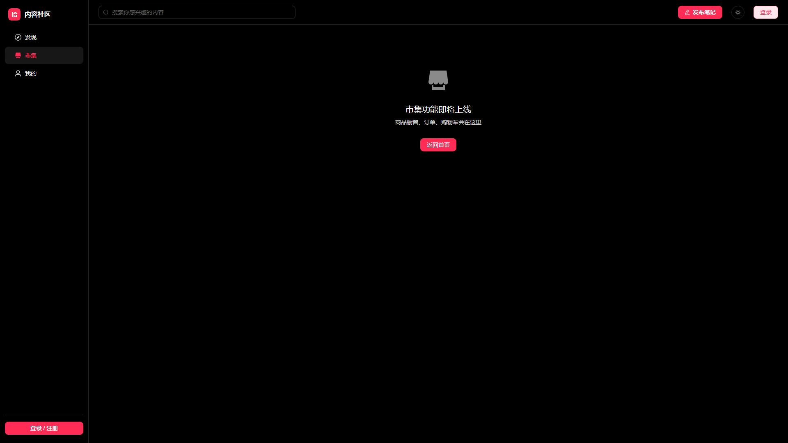

# 内容社区 (Content Sharing Platform)

一个仿小红书 UI/UX 的全栈内容社区前端 + 后端项目。**PC 桌面端**布局，组件层使用 Element Plus（完全接管其主题变量），后端零外部框架、本地 SQLite 存储、ORM 层手写 SQL。目标是展示一个完整的前后端分离项目的工程能力。


## ✨ 已实现功能

| 模块     | 功能                                                                                                                                                                                                                    |
| -------- | ----------------------------------------------------------------------------------------------------------------------------------------------------------------------------------------------------------------------- |
| 账号     | 注册 / 登录 / JWT 鉴权 / 自动登录态持久化 (Pinia + localStorage)                                                                                                                                                        |
| 内容     | 发布笔记 (文本 + 1~9 张图，带逐图上传进度条) / 真瀑布流 feed / 笔记详情 / 图片灯箱预览                                                                                                                                  |
| 搜索     | 顶栏输入即出「笔记 / 话题 / 用户」三类候选 + 热门话题占位 + ↑↓/Enter/Esc 键盘导航；结果页支持三路匹配、<br>最新·最多点赞·最多评论排序、命中高亮、搜索历史（去重置顶 / 单删 / 清空）                                     |
| 互动     | 点赞 (可选登录态) / 评论 (登录态) / 评论列表                                                                                                                                                                            |
| 个人主页 | 封面 banner / 头像 / 三栏统计 / 4 个 tab + 公开/私密/合集筛选 / ElDialog 编辑资料 / 推荐关注                                                                                                                            |
| 消息     | 两个顶层 Tab：通知（赞和收藏 / 新增关注 / 评论和@，数据仍是 mock）+ **实时聊天**（WebSocket 1v1：会话列表 / 历史分页 / 未读红点 / 已读回执 / 正在输入 / 多端同步 / 断线重连补发）；顶栏铃铛显示总未读                   |
| 布局     | 桌面三栏：左侧固定 ElMenu（发现 / 发布 / 市集 / 我的 / 设置）+ 顶部栏（搜索 / 发布 / 主题 / 消息铃铛 / 用户菜单）+ 内容区；登录页走独立全屏                                                                             |
| 首页频道 | 12 个内容频道用 ElTabs 平铺一行（推荐 / 穿搭 / 美食 / 彩妆 / 影视 / 职场 / 情感 / 家居 / 游戏 / 旅行 / 健身 / 视频），选中态为居中红色短条                                                                              |
| 设置     | 5 组设置项卡片 + 深色模式 ElSwitch + 账号摘要 + 退出登录 + 协议链接                                                                                                                                                     |
| 动效     | 五档时长 + 缓动字典 + CSS 原生弹簧（`linear()`，不需要动画库）；按语义分向入场（自己发的从右下、对方发的从左滑）；未读红点 pop / 铃铛来信摆一下；全局 `prefers-reduced-motion` 兜底，键盘用户有 `:focus-visible` 焦点环 |
| 主题     | 暗色 / 亮色切换（`html.dark` 驱动，Element Plus 变量同步切换 + localStorage 持久化）                                                                                                                                    |

> 路线图见 [docs/architecture.md](docs/architecture.md#路线图)

## 📸 界面预览

首页见上方。全部为 1920×1080 真实运行截图，由 `node scripts/screenshot-docs.mjs` 生成（脚本会自建临时账号造数据，跑完可一键清理）。

### 搜索：顶栏即时建议 → 结果页

| 搜索建议下拉                                             | 搜索页                                     |
| -------------------------------------------------------- | ------------------------------------------ |
|  |  |

### 笔记详情 / 发布 / 个人主页

| 笔记详情                                     | 发布页                                     | 个人主页                                      |
| -------------------------------------------- | ------------------------------------------ | --------------------------------------------- |
|  |  |  |

### 市集 / 消息 / 设置

| 市集                                    | 消息中心                                      | 设置                                      |
| --------------------------------------- | --------------------------------------------- | ----------------------------------------- |
|  |  |  |

## 🛠 技术栈

**前端** ([client/](client/))

- Vue 3.5 (Composition API + `<script setup>`)
- TypeScript 5.6
- Vite 6 (含 `/uploads` 反代解决 dev 跨域)
- **Element Plus 2.14** + `@element-plus/icons-vue`，通过 `unplugin-vue-components` 按需自动引入
- Pinia 4 + `pinia-plugin-persistedstate` (auth 持久化)
- Vue Router 4
- Axios 1 (formdata 走原生 XHR 绕开 multipart bug)

**后端** ([server/](server/))

- Node.js + Express 5
- better-sqlite3 (同步 SQLite，本地文件)
- bcryptjs (密码哈希)
- jsonwebtoken (JWT 鉴权)
- multer (multipart/form-data 上传，diskStorage)

## 🚀 本地开发

```bash
# 1. 启动后端（:3000）
cd server
npm install
npm run dev          # tsx watch src/index.ts

# 2. 启动前端（:5173）
cd client
npm install
npm run dev          # vite
```

打开 http://localhost:5173/ 注册账号即可使用。图片会上传到 `server/uploads/`，前端 `/uploads/*` 通过 `server.proxy` 反代到 3000（生产 nginx 同源直出）。

### 测试

```bash
npm run test:client          # 前端单测（vitest + @vue/test-utils，48 条）
cd server && npm test        # 后端单测（vitest + supertest，63 条）

npm run test:e2e             # Playwright 桌面端全流程回归（登录态）
npm run test:search          # 搜索功能 + 注入防护
npm run test:center          # 1920 宽屏下逐页检查左右留白是否居中
npm run test:chat            # 即时通信：多端同步 / 已读回执 / 断线重连补发（开两个浏览器上下文）
npm run test:motion          # 动效验证：证明入场真的在推进，且 reduced-motion 下真的停
npm run screenshot           # 重新生成 docs/screenshots/ 下的 README 配图
```

> Playwright 脚本依赖 dev server 在跑；**刚重启 vite 时第一次跑会因为 Element Plus 依赖预构建未完成而假失败**（`el-*` 判不可见但零 console error），先 `curl localhost:5173` 触发预构建、等十几秒再跑即可。

## 📁 项目结构

```
content-sharing-platform/
├─ client/                     # Vue 3 + Vite 前端
│  ├─ src/
│  │  ├─ views/                # 10 个路由级页面（Home / PostDetail / Publish / Profile / Messages / Market / Search / Settings / Login / NotFound）
│  │  ├─ components/           # SideNav（左侧导航）/ TopBar（顶部栏）/ PostMasonry（最短列优先瀑布流，首页与搜索页共用）/ EmptyState / ErrorBoundary
│  │  ├─ assets/styles/        # theme.css（自有 design token） + element-theme.css（Element Plus 变量接管）
│  │  ├─ composables/          # useRelativeTime（相对时间） / useTheme（主题共享状态） / useSearchHistory（顶栏与结果页共用的搜索历史）
│  │  ├─ api/                  # request.ts (axios 实例 + 拦截器) / auth.ts / posts.ts
│  │  ├─ utils/masonry.ts      # 瀑布流纯函数：列数换算 / 高度估算 / 最短列优先分列 / 关键词切分
│  │  ├─ stores/               # Pinia: auth / toast / homeTabs
│  │  ├─ router/               # Vue Router 配置（含 requiresAuth / guestOnly 守卫）
│  │  └─ constants.ts          # 客户端常量（与 server mirror）
│  ├─ tests/                    # vitest + @vue/test-utils（jsdom）：masonry 纯函数 / 搜索历史 / PostMasonry 渲染与转义
│  ├─ components.d.ts          # unplugin-vue-components 生成的组件声明
│  ├─ vite.config.ts           # 按需引入插件 + /uploads 反代
│  └─ vitest.config.ts         # 前端单测配置（jsdom + @ 别名，与生产构建配置分开）
│
├─ server/                     # Express + SQLite 后端
│  ├─ src/
│  │  ├─ index.ts              # 入口，挂载中间件 + 路由
│  │  ├─ lib/db.ts             # better-sqlite3 连接 + 建表
│  │  ├─ middleware/auth.ts    # JWT 校验 (requireAuth / optionalAuth)
│  │  ├─ routes/               # auth / users / posts / comments / likes / uploads
│  │  └─ constants.ts          # 服务端常量（与 client mirror）
│  └─ uploads/                 # multer 落地目录（.gitignore）
│
├─ scripts/                    # Playwright 自动化 + 文档配图生成
│  ├─ desktop-smoke.mjs        # 桌面端登录态全流程回归（40+ 断言，含零 console error 断言）
│  ├─ search-smoke.mjs         # 搜索功能回归（24 断言）
│  ├─ center-audit.mjs         # 1920 宽屏下逐页量左右留白，防止"看起来居中其实没居中"
│  ├─ check-search.mjs         # 搜索 API 注入检查（% / _ / ' OR 1=1-- 必须返回 0 条）
│  └─ screenshot-docs.mjs      # 生成 docs/screenshots/ 下的 README 配图
│
└─ docs/
   ├─ architecture.md          # 架构图 / 数据模型 / 关键流程 / 踩坑记录
   └─ screenshots/             # README 配图（1920×1080，由 screenshot-docs.mjs 生成）
```

## 🎯 设计决策（简历可以聊的点）

- **用 Element Plus，但主题 100% 自己接管**：组件库只提供行为和骨架，视觉完全由 `element-theme.css` 重写 `--el-*` 变量 + 覆写组件选择器（见下方"主题接管"），交付出来仍然是自己的设计系统，而不是默认蓝配默认圆角
- **不引 ORM**：手写 SQL（`better-sqlite3.prepare(...).all()`），同步接口比 async 好读
- **不引 Tailwind**：CSS variables 主题切换 + scoped CSS，便于改设计 token
- **Flat + Outline 设计系统**：对齐小红书——纯色底（dark `#000` / light `#fff`）、无毛玻璃无渐变光斑、1px 描边分组、红色 `#ff2d55` 只用于强调（关注按钮 / 话题标签 / 选中态）；dark / light 双主题共用一套 token
- **组件按需引入而非全量注册**：`unplugin-vue-components` + `ElementPlusResolver`，构建产物里每个 EP 组件是独立 chunk，首页不加载 `el-upload` / `el-dialog` 的代码
- **防御性校验**：所有限制（content ≤ 500 字、图 ≤ 10MB）双端校验，client 立即反馈 + server 拒绝非法请求
- **Vue 3 reactivity 坑**：uploaded image 对象用 `reactive()` 显式包一层，绕开 `ref([]).push(plain)` 不会自动 proxy 子项的陷阱（详见 [docs/architecture.md](docs/architecture.md#踩过的坑)）
- **后端 hardening**：dotenv + 启动期 env 校验、express-rate-limit（auth 5/min，写接口 20/min）、统一错误中间件（multer / JSON parse / 404）、password 列名迁移到 password_hash
- **可测试架构**：db 模块用 Proxy 模式让测试注入 `:memory:` 实例，schema 抽成函数生产测试共用；vitest 覆盖 auth / posts / likes / comments / users / uploads **53 个 case**

## 💡 工程亮点（面试可以深聊的点）

### 前端

| 亮点                            | 实现                                                                                                                                                                                             | 踩过的坑                                                                                                                                               |
| ------------------------------- | ------------------------------------------------------------------------------------------------------------------------------------------------------------------------------------------------ | ------------------------------------------------------------------------------------------------------------------------------------------------------ |
| **Element Plus 主题接管**       | `element-theme.css` 用 `html.dark` / `html:not(.dark)` 双选择器重写 40+ 个 `--el-*` 变量（主色 / 背景层级 / 文字层级 / 描边 / 填充 / 阴影 / 圆角），再覆写输入框、卡片、弹层、菜单、表格的选择器 | Element Plus 自带的深色变量用 `html.dark`（特异度 0,1,1），比 `:root`（0,1,0）高。只写 `:root` 的话，用户切深色时会被官方变量反覆盖                    |
| **按需引入 + 全局变量分层**     | 组件与组件样式由 `unplugin-vue-components` 自动 import；`main.ts` 只手动引三份全局 CSS：`base.css`（官方 `:root` 变量）→ `dark/css-vars.css` → 自己的 `element-theme.css`                        | 单独引 `element-plus/dist/index.css` 是 360KB 全量样式，会和按需引入的样式重复；单独引组件样式又缺 `:root` 变量，组件颜色全丢                          |
| **CSS import 顺序即优先级**     | 自定义主题文件必须放在官方样式**之后**且选择器特异度相同，否则被官方规则盖掉                                                                                                                     | "我的主题没生效" 十次里有八次是顺序或特异度问题，不是变量名写错                                                                                        |
| **响应式双栏降级**              | 详情 / 发布 / 主页 / 消息四个页面都是 `1fr + 固定右栏` 的 grid，≤1100px 时降级成单栏、右栏 `position: static`                                                                                    | 桌面布局在窄视口下会把左栏压到几十像素，两栏直接叠在一起。侧栏 216px 是固定成本，必须按**内容区**而不是视口宽度算断点                                  |
| **sticky 的前置条件**           | 移除了 `html, body { overflow-x: hidden }`，SideNav / TopBar 的 `position: sticky` 才稳定                                                                                                        | 祖先有 `overflow: hidden` 时 sticky 相对祖先滚动区而非 viewport 计算，会静默失效——不报错，元素就是不吸顶                                               |
| **共享状态用 store 不用 props** | `homeTabs` store 让 HomeView 的 ElTabs / ElRadioGroup 和频道分类筛选订阅同一份 channel / category state                                                                                          | 组件层级跨越 `router-view` 时 props drilling 不可行                                                                                                    |
| **路由级错误边界**              | `ErrorBoundary.vue` 用 `onErrorCaptured` 捕获 render 期同步异常，渲染降级 UI + 重试按钮，避免白屏                                                                                                | 只兜同步异常；异步错误靠每个 view 自己的 `errorMsg` ref                                                                                                |
| **抽 EmptyState 消除重复**      | 封装 `loading` / `empty` / `error` 三态 + `compact` prop，内部直接用 ElSkeleton / ElEmpty                                                                                                        | —                                                                                                                                                      |
| **404 catch-all**               | `/:pathMatch(.*)*` 路由 + ElResult 风格的 NotFoundView                                                                                                                                           | —                                                                                                                                                      |
| **上传进度条绕开 axios**        | 用原生 `XMLHttpRequest.upload.onprogress` 而不是 axios                                                                                                                                           | axios 1.x 在 instance 默认 `Content-Type: application/json` 时会把 FormData 转成 JSON 字符串发出去，multer 收不到文件                                  |
| **API 层类型对齐**              | 响应拦截器 `return response.data` 抹掉 `AxiosResponse` 包装，但 axios 1.x 的类型不会传播拦截器返回类型。给实例加一层 `UnwrappedInstance` 接口断言，让静态类型和运行时一致                        | 之前的写法让 `await request.post<Foo>()` 被推断成 `AxiosResponse<Foo>`，调用方读 `.foo` 直接 TS2339；靠 `as unknown as Foo` 到处打补丁只是把问题藏起来 |
| **瀑布流栅格**                  | 纯 CSS：`repeat(auto-fill, minmax(240px, 1fr))` 自适应列数 + 6 张一组循环 `aspect-ratio`（1/1 → 3/4 → 4/5 → 3/5 → 2/3 → 5/6）+ `align-items: start`                                              | 浏览器原生 `grid-template-rows: masonry` 只有 Firefox 支持，只能用 nth-child 模拟                                                                      |

### 后端

| 亮点                         | 实现                                                                                                                     |
| ---------------------------- | ------------------------------------------------------------------------------------------------------------------------ |
| **可测试架构（Proxy 注入）** | `db.ts` 用 `new Proxy()` 包装，测试用 `setTestDb(new Database(':memory:'))` 注入内存实例，生产文件 DB 和测试实例互不污染 |
| **schema 抽取复用**          | `CREATE TABLE` 抽到 `lib/schema.ts` 的 `initSchema(db)`，生产启动和每个测试文件共用同一份 DDL                            |
| **53 个集成测试**            | vitest 6 个测试文件覆盖 auth / posts / likes / comments / users / uploads；`fileParallelism: false` 避免共享 DB 竞态     |
| **分层限流**                 | `express-rate-limit` 三档：auth 5/min、writes 20/min、uploads 30/min，`NODE_ENV=test` 自动跳过                           |
| **全局错误中间件**           | `AppError` 类 + 4 个 catch 层（multer / JSON parse / 404 / 未知错误），统一响应格式，日志分级                            |
| **env 启动校验**             | `lib/env.ts` 用 dotenv 加载后校验 `JWT_SECRET` 必填，缺失直接 fail fast 而不是运行时才炸                                 |

### 工程化

| 亮点                             | 实现                                                                                                                                                                                                                                                                                                                                                      |
| -------------------------------- | --------------------------------------------------------------------------------------------------------------------------------------------------------------------------------------------------------------------------------------------------------------------------------------------------------------------------------------------------------- |
| **ESLint + Prettier + Husky**    | lint-staged 在 pre-commit 跑 eslint + prettier；commitlint 强制 conventional commits（subject ≤ 72 字符）                                                                                                                                                                                                                                                 |
| **ESLint / Prettier 规则解冲突** | `semi: false` 的 prettier 会删分号，但 `eslint:recommended` 的 `no-extra-semi` 会报错，两者来回翻转。接入 `eslint-config-prettier` 并放在 `extends` **最后**，关闭所有纯格式规则，让 prettier 成为格式的唯一权威                                                                                                                                          |
| **CI 类型检查曾经是假的**        | `client/tsconfig.json` 是 solution-style（`files: []` + `references`），`vue-tsc --noEmit` 直接跑等于什么都没检查，10+ 个 TS 报错被 CI 静默放过。CI 改成 `vue-tsc --noEmit -p tsconfig.app.json` 后立刻暴露，顺手把 API 层类型修对                                                                                                                        |
| **GitHub Actions CI**            | 3 个并行 job：`server`（vitest + tsc）/ `client`（vue-tsc + vitest + build）/ `lint`（eslint + prettier --check），ubuntu-latest + Node 24（vitest 5 与 better-sqlite3 13 的 engines 都要求 ≥ 22，Node 20 会让"Install deps"假绿然后在 `vitest run` 挂掉）；本地能过的命令 CI 也必须能过                                                                  |
| **前端单测不是摆设**             | 分列、高度估算、关键词切分抽成 `utils/masonry.ts` 的纯函数，不挂组件就能喂数据断言。48 条用例覆盖：分列均衡性（含与"轮流分"的定量对比）、ratio 按全局下标循环、脏 `localStorage` 容错、以及**高亮渲染后 HTML 被转义**（`find('script')` 必须为 false）。`tsconfig.app.json` 的 `include` 特意带上 `tests/`，否则测试文件里的类型错误 `vue-tsc` 永远看不见 |
| **多端实时同步（IM）**           | `ws` 库手写 JSON 协议（不用 Socket.IO）。核心是 `Hub` 里 **`Map<userId, Set<WebSocket>>`** —— 一个账号可挂 N 个连接，推消息时把 Set 全推一遍，「电脑发手机收」就成了自然结果，没有额外同步代码。若用 `Map<userId, WebSocket>`，用户的第二个标签页会直接变成哑巴                                                                                           |
| **IM 的三个易漏点**              | ① 浏览器 WS API 不能自定义 header，token 只能走 query —— 代价是可能进网关日志，办法是校验失败立刻用 4401 关闭、全程不打握手 URL；② 断线重连必须带 **sync 补偿**（心跳 ping/pong 只保证连接活着，不负责补数据），断网期间的消息全靠它；③ 重连退避要加**随机抖动**，否则服务重启后所有客户端在同一毫秒一起冲上来会把它再打挂                                |
| **端到端冒烟**                   | Playwright 跑完整登录态链路：注册临时账号 → UI 登录 → 六项侧栏导航 → 发笔记 → 点赞 → 评论 → 编辑资料 → 主题切换 → 退出登录，40+ 断言且同时断言"零 console error + 零失败请求"；收尾自动清理测试数据，不污染演示库                                                                                                                                         |
| **搜索三路匹配 + 注入防护**      | `GET /api/posts/search` 同时匹配正文 / 话题标签 / 作者昵称。`LIKE` 通配符 `%` `_` 必须转义并配 `ESCAPE`，否则用户搜 "100%" 会退化成全表通配；排序走白名单枚举，绝不把 `req.query` 直接拼进 `ORDER BY`                                                                                                                                                     |
| **搜索建议独立接口**             | `GET /api/posts/search/suggest` 单独开而不复用 `/search`：结果页要「按排序分页的完整列表」，建议框要「少量、去重、按相关度稳定的短列表」，语义和排序都不同。`q` 为空时返回按笔记数排序的热门话题填充下拉；前端 250ms 防抖 + 请求序号丢弃过期响应，避免快速连打时被旧响应覆盖                                                                              |
| **真瀑布流分列**                 | 不用 CSS grid（行高被最高卡撑开，短卡下面留大片空白），也不用 CSS columns（column-major 阅读顺序变竖读），改用「最短列优先」自建分列 + ResizeObserver 算列数；首页和搜索页共用同一个 `PostMasonry` 组件                                                                                                                                                   |
| **零 console 残留**              | 调试日志统一走 `[Prefix]` 格式，方便后期清理或加日志级别                                                                                                                                                                                                                                                                                                  |

## 📚 文档

- [架构图 / 数据模型 / 关键流程 / 踩坑记录](docs/architecture.md)
- 路线图：发布笔记 → 点赞 / 评论 → 个人主页重构 → 图片上传 → 移动端对齐 → **当前**（PC 桌面端 + Element Plus 重构）

## 🔐 安全性

- 密码 bcryptjs hash（不存明文）
- JWT 7 天有效期，前端 Pinia 持久化 token
- 所有写接口（发布 / 评论 / 点赞 / 上传）走 `requireAuth` 中间件
- 上传：multer 校验 mimetype + 单文件 ≤ 10MB + 一次 ≤ 9 张
- SQL：用 `?` 参数化，无字符串拼接
- 登录后跳转 `?redirect=` 只接受站内路径（`startsWith('/')` 且不以 `//` 开头），防开放重定向
- CORS：开发全开；生产应限制 origin

## 📄 License

MIT — 仅用于学习与作品投递。见 [LICENSE](LICENSE)。
