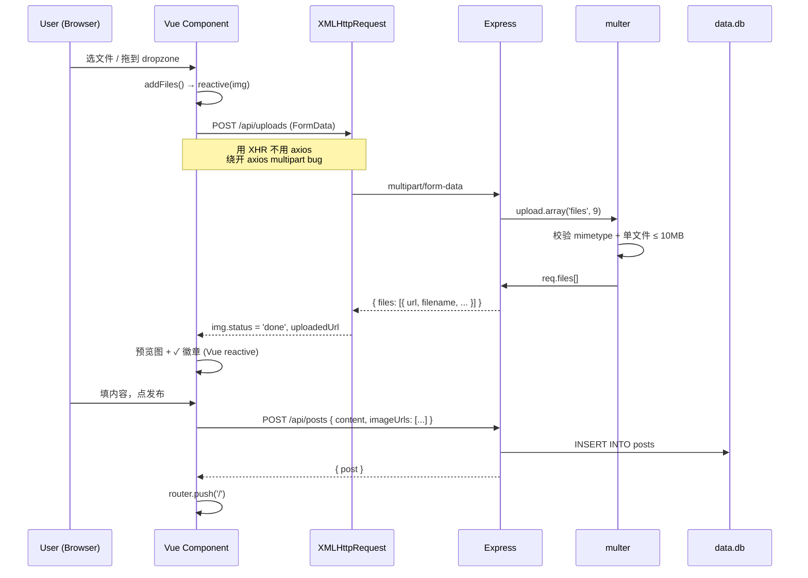

# 架构文档

## 系统总览

```
Browser (Vue 3 SPA :5173)
   │  HTTP/JSON
   │  Authorization: Bearer <jwt>
   ▼
Vite dev server (proxy /uploads → :3000)
   │
   ▼
Express :3000  ── better-sqlite3 ──► data.db (SQLite file)
   │
   └─► /uploads/* (静态文件)
```

## 数据模型

```mermaid
erDiagram
    users {
        int id PK
        text nickname "20 字以内"
        text password_hash "bcrypt"
        text avatar
        text cover
        text created_at
    }
    posts {
        int id PK
        int user_id FK
        text content "500 字以内"
        text image_urls "JSON array"
        text topic_tag
        text created_at
    }
    likes {
        int id PK
        int user_id FK
        int post_id FK
        text created_at
        UNIQUE(user_id, post_id)
    }
    comments {
        int id PK
        int user_id FK
        int post_id FK
        text content "500 字以内"
        text created_at
    }
    users ||--o{ posts : "发布"
    users ||--o{ likes : "点赞"
    users ||--o{ comments : "评论"
    posts ||--o{ likes : "被点赞"
    posts ||--o{ comments : "被评论"
```

外键 ON DELETE CASCADE：删除用户 / 帖子时关联点赞评论一并清掉。

## 请求流程：上传 + 发布



## 关键模块说明

### Auth (JWT)

- **签发**：`POST /api/auth/login` 校验密码后用 `jsonwebtoken.sign({ userId }, SECRET, { expiresIn: '7d' })` 签发
- **校验**：`middleware/auth.ts#requireAuth` 解码 Bearer token → 注入 `req.user`
- **可选鉴权**：`optionalAuth` 用于点赞（未登录也能 GET，但写必须登录）
- **前端持久化**：Pinia + `pinia-plugin-persistedstate` 把 token + user 写到 localStorage，刷新不丢

### Upload pipeline

- **前端**：`<input type="file" hidden>` + dropzone @click 触发。Vue 组件用 `reactive()` 包 pending image 对象（绕开 Vue 3 push 不会自动 proxy 的坑）
- **传输**：原生 `XMLHttpRequest`（不用 axios 1.x，因为 instance 默认 `Content-Type: application/json` 会让 axios 把 FormData stringify 成 JSON，multer 收不到文件）
- **后端**：multer `diskStorage` 落到 `server/uploads/`，文件名 `<timestamp>-<8hex>.<ext>` 防冲突
- **dev 静态服务**：vite.config 的 `server.proxy['/uploads']` 反代到 3000，否则浏览器 GET 落到 Vite SPA fallback 返 text/html

## 踩过的坑

### Vue 3 reactive() 数组 push 不自动 proxy 子项（2026-09-20）

```ts
// ❌ 直接 push plain object → XHR onload 里改 img.status 不触发 UI
const img = { status: 'pending' }
images.value.push(img)
img.status = 'done'  // UI 永远卡在 uploading
```

```ts
// ✅ 用 reactive() 包一层，闭包持有 Proxy
const img = reactive({ status: 'pending' })
images.value.push(img)
img.status = 'done'  // 触发 set trap → 重渲染
```

Vue 3 数组的 push hook 是 `rawArr.push(...args)`，items 不会自动 proxy。读时数组 get trap 会自动 wrap，但写必须显式走 Proxy。

### axios 1.x FormData 被 stringify（2026-09-19）

```ts
// ❌ instance 默认 Content-Type: application/json → FormData 转 JSON 字符串
const request = axios.create({ headers: { 'Content-Type': 'application/json' } })
request.post('/upload', formData, ...)  // multer 收不到文件
```

```ts
// ✅ 不要在 instance 上设默认 Content-Type
const request = axios.create({})  // 让 axios 根据 data 决定
```

但实际项目里更稳的是绕开它直接用 XHR，所以 publish 用原生 XHR 上传。

### Vite SPA fallback 吞 /uploads（2026-09-20）

dev 模式下前端 :5173、后端 :3000。`` 浏览器解析到 5173，Vite SPA fallback 返 text/html。

```ts
// vite.config.ts
server: {
  proxy: {
    '/uploads': { target: 'http://localhost:3000', changeOrigin: true }
  }
}
```

生产单源（nginx 同源）无需此配置。

### XHR 必须绝对 URL（2026-09-19）

```ts
// ❌ 相对路径 → Vite 5173 (SPA fallback)
xhr.open('POST', '/api/uploads')

// ✅ 绝对 URL → 后端 3000
xhr.open('POST', `${API_BASE}/uploads`)
```

### setRequestHeader 必须在 open() 之后

```ts
xhr.open('POST', url)              // 先 open
xhr.setRequestHeader('Auth', ...)  // 再 setHeader
xhr.send(formData)
```

倒过来会抛 InvalidStateError。

## 路线图

- [x] 阶段 0：项目骨架（Vite + Vue 3 + TS，路由、Pinia、axios）
- [x] 阶段 1：Express + SQLite 后端，真注册真登录
- [x] 阶段 2：发布笔记（图文）+ feed 瀑布流 + 详情页
- [x] 阶段 3：点赞 + 评论（后端 optional auth + 前端 reactive）
- [x] 阶段 4：个人主页（banner + 头像 + tab + 编辑资料 modal）
- [x] 阶段 5：图片上传（multer + Vite proxy + reactive 修复）
- [x] **当前**：布局对齐小红书参考（BottomNav / ProfileView / MessagesView / MarketView 占位）
- [x] 代码抛光：清理调试 log + 抽 constants + 文档
- [ ] 后续（候选）：关注/粉丝、消息通知后端实现、收藏功能、搜索、市集（电商太大可拆项目）

## 关键文件索引

| 关注点 | 文件 |
|--------|------|
| 上传核心 | `client/src/views/PublishView.vue` / `server/src/routes/uploads.ts` |
| 鉴权 | `client/src/api/request.ts` / `client/src/stores/auth.ts` / `server/src/middleware/auth.ts` |
| 数据模型 | `server/src/lib/db.ts` |
| 路由 | `client/src/router/index.ts` |
| 全局常量 | `client/src/constants.ts` / `server/src/constants.ts` |
| 底部导航 | `client/src/components/BottomNav.vue` |