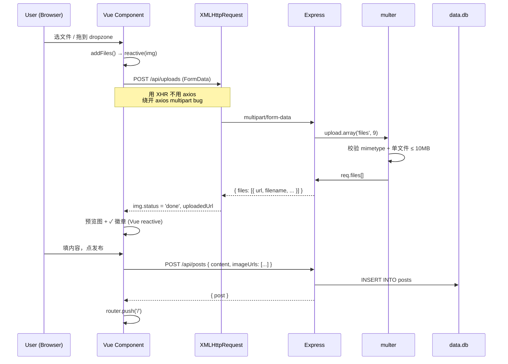

# 架构文档

## 系统总览

```
Browser (Vue 3 SPA :5173)
   │  HTTP/JSON
   │  Authorization: Bearer <jwt>
   ▼
Vite dev server (proxy /uploads → :3000)
   │
   ▼
Express :3000  ── better-sqlite3 ──► data.db (SQLite file)
   │
   └─► /uploads/* (静态文件)
```

## 数据模型

> 下面是**内容域**的核心关系。完整表清单见 `server/src/lib/schema.ts`，
> 那里每张表的注释都写了「为什么这么建」，比这里更详细。
> 交易域（products / cart_items / orders / order_items / wallets /
> wallet_transactions / transit_accounts / transit_transactions）
> 见[市集一节](#市集与支付)。

```mermaid
erDiagram
    users {
        int id PK
        text nickname "20 字以内"
        text password_hash "bcrypt"
        text avatar
        text cover
        text created_at
    }
    posts {
        int id PK
        int user_id FK
        text content "500 字以内"
        text image_urls "JSON array"
        text topic_tag
        text created_at
    }
    likes {
        int id PK
        int user_id FK
        int post_id FK
        text created_at
        UNIQUE(user_id, post_id)
    }
    comments {
        int id PK
        int post_id FK
        int user_id FK
        int parent_id "二级回复，无外键"
        text content
        text pinned_at "作者置顶"
        text created_at
    }
    follows {
        int follower_id PK
        int followee_id PK
        text created_at
    }
    favorites {
        int user_id PK
        int post_id PK
        int folder_id FK "可空 = 未分类"
        text created_at
    }
    post_feedback {
        int user_id PK
        int post_id PK
        text action "not_interested / not_author"
    }
    feed_sessions {
        text id PK "uuid"
        int user_id "游客为 NULL"
        int expires_at
    }
    feed_session_items {
        text session_id PK
        int rank PK "从 1 开始"
        int post_id FK
        real score
        text reason
    }
    view_history {
        int user_id PK
        int post_id PK
        text viewed_at "毫秒精度"
    }

    users ||--o{ posts : "发布"
    users ||--o{ likes : "点赞"
    users ||--o{ comments : "评论"
    posts ||--o{ likes : "被点赞"
    posts ||--o{ comments : "被评论"
    users ||--o{ follows : "关注"
    users ||--o{ favorites : "收藏"
    users ||--o{ view_history : "浏览过"
    users ||--o{ post_feedback : "负反馈"
    feed_sessions ||--o{ feed_session_items : "冻结的排序"
```

外键 ON DELETE CASCADE：删除用户 / 帖子时关联点赞评论一并清掉。
`better-sqlite3` 默认开启 `foreign_keys`，但 `db.ts` 里仍显式 `pragma` 了一次 ——
依赖库的默认值不是可以赌的东西。

### 三处「刻意不建外键」

| 位置                         | 原因                                                                                                                                                                                      |
| ---------------------------- | ----------------------------------------------------------------------------------------------------------------------------------------------------------------------------------------- |
| `comments.parent_id`         | `ALTER TABLE ADD COLUMN` 不支持加外键（外键只能在 CREATE TABLE 时声明），而表已存在。为一张老表做「新建 + 拷贝 + 改名」代价远大于收益。删父评论时是否级联删回复，本来就该由应用层显式决定 |
| `order_items.product_id`     | 商品被删之后订单行必须留着，否则「我买过什么」的历史会跟着商品一起消失                                                                                                                    |
| `feed_session_items.post_id` | 快照是一次性的；笔记被删之后 JOIN 自然查不到，读取时跳过并让游标照常前进                                                                                                                  |

## 请求流程：上传 + 发布


```mermaid
sequenceDiagram
    participant U as User (Browser)
    participant V as Vue Component
    participant X as XMLHttpRequest
    participant E as Express
    participant M as multer
    participant D as data.db

    U->>V: 选文件 / 拖到 dropzone
    V->>V: addFiles() → reactive(img)
    V->>X: POST /api/uploads (FormData)
    Note over V,X: 用 XHR 不用 axios<br/>绕开 axios multipart bug
    X->>E: multipart/form-data
    E->>M: upload.array('files', 9)
    M->>M: 校验 mimetype + 单文件 ≤ 10MB
    M->>E: req.files[]
    E-->>X: { files: [{ url, filename, ... }] }
    X-->>V: img.status = 'done', uploadedUrl
    V->>V: 预览图 + ✓ 徽章 (Vue reactive)
    U->>V: 填内容，点发布
    V->>E: POST /api/posts { content, imageUrls: [...] }
    E->>D: INSERT INTO posts
    E-->>V: { post }
    V->>V: router.push('/')
```

## 关键模块说明

### Auth (JWT)

- **签发**：`POST /api/auth/login` 校验密码后用 `jsonwebtoken.sign({ userId }, SECRET, { expiresIn: '7d' })` 签发
- **校验**：`middleware/auth.ts#requireAuth` 解码 Bearer token → 注入 `req.user`
- **可选鉴权**：`optionalAuth` 用于点赞（未登录也能 GET，但写必须登录）
- **前端持久化**：Pinia + `pinia-plugin-persistedstate` 把 token + user 写到 localStorage，刷新不丢

### Upload pipeline

- **前端**：`<input type="file" hidden>` + dropzone @click 触发。Vue 组件用 `reactive()` 包 pending image 对象（绕开 Vue 3 push 不会自动 proxy 的坑）
- **传输**：原生 `XMLHttpRequest`（不用 axios 1.x，因为 instance 默认 `Content-Type: application/json` 会让 axios 把 FormData stringify 成 JSON，multer 收不到文件）
- **后端**：multer `diskStorage` 落到 `server/uploads/`，文件名 `<timestamp>-<8hex>.<ext>` 防冲突
- **dev 静态服务**：vite.config 的 `server.proxy['/uploads']` 反代到 3000，否则浏览器 GET 落到 Vite SPA fallback 返 text/html

## 踩过的坑

### Vue 3 reactive() 数组 push 不自动 proxy 子项（2026-09-20）

```ts
// ❌ 直接 push plain object → XHR onload 里改 img.status 不触发 UI
const img = { status: 'pending' }
images.value.push(img)
img.status = 'done' // UI 永远卡在 uploading
```

```ts
// ✅ 用 reactive() 包一层，闭包持有 Proxy
const img = reactive({ status: 'pending' })
images.value.push(img)
img.status = 'done' // 触发 set trap → 重渲染
```

Vue 3 数组的 push hook 是 `rawArr.push(...args)`，items 不会自动 proxy。读时数组 get trap 会自动 wrap，但写必须显式走 Proxy。

### axios 1.x FormData 被 stringify（2026-09-19）

```ts
// ❌ instance 默认 Content-Type: application/json → FormData 转 JSON 字符串
const request = axios.create({ headers: { 'Content-Type': 'application/json' } })
request.post('/upload', formData, ...)  // multer 收不到文件
```

```ts
// ✅ 不要在 instance 上设默认 Content-Type
const request = axios.create({}) // 让 axios 根据 data 决定
```

但实际项目里更稳的是绕开它直接用 XHR，所以 publish 用原生 XHR 上传。

### Vite SPA fallback 吞 /uploads（2026-09-20）

dev 模式下前端 :5173、后端 :3000。`` 浏览器解析到 5173，Vite SPA fallback 返 text/html。

```ts
// vite.config.ts
server: {
  proxy: {
    '/uploads': { target: 'http://localhost:3000', changeOrigin: true }
  }
}
```

生产单源（nginx 同源）无需此配置。

### XHR 必须绝对 URL（2026-09-19）

```ts
// ❌ 相对路径 → Vite 5173 (SPA fallback)
xhr.open('POST', '/api/uploads')

// ✅ 绝对 URL → 后端 3000
xhr.open('POST', `${API_BASE}/uploads`)
```

### setRequestHeader 必须在 open() 之后

```ts
xhr.open('POST', url)              // 先 open
xhr.setRequestHeader('Auth', ...)  // 再 setHeader
xhr.send(formData)
```

倒过来会抛 InvalidStateError。

## 市集与支付

```
买家  ──hold───▶  平台在途  ──settle──▶  卖家     （买家确认收货）
                    │
                    └──release─▶  买家          （退款，钱原路退回）
```

**守恒律：所有钱包余额 + 在途余额 == 充值总额。**
`GET /api/wallet/audit` 和钱包页上那条对勾都是在算这条式子。

为什么必须有「在途」这一层：常见做法「拍下即付款，钱直接给卖家」
在这个项目里立刻崩 —— 买家付了 12850，卖家余额 +12850，账是平的，
但买家退款就��**从卖家账里扣**。卖家一旦把余额花掉，这笔钱扣不回来，
于是要么退款失败（业务上荒谬），要么允许卖家余额为负（违反 CHECK 约束）。

退款只发生在结算之前（`completed` 和 `refunded` 都是终态），
所以「退款退不回来」在设计上就不存在，不是靠兜底逻辑挡住的。

在途独立成表而不是塞进 `wallets`：`wallets.user_id` 有
`FOREIGN KEY REFERENCES users(id)`，写一个假的平台 user_id 要么被外键挡，
要么得为绕过外键放松约束。而且用户钱包是「用户能花的钱」，
在途是「用户碰不到的钱」—— 混一张表的话任何遍历 wallets
算累计资产的代码都会把在途算进去。

详见 `server/src/lib/transit.ts` 的文件头注释。

## 路线图

- [x] 阶段 0：项目骨架（Vite + Vue 3 + TS，路由、Pinia、axios）
- [x] 阶段 1：Express + SQLite 后端，真注册真登录
- [x] 阶段 2：发布笔记（图文）+ feed 瀑布流 + 详情页
- [x] 阶段 3：点赞 + 评论（后端 optional auth + 前端 reactive）
- [x] 阶段 4：个人主页（banner + 头像 + tab + 编辑资料 modal）
- [x] 阶段 5：图片上传（multer + Vite proxy + reactive 修复）
- [x] 阶段 6：桌面端重构（Element Plus + 三栏布局，取代移动端 BottomNav / 抽屉）
- [x] 阶段 7：即时通讯（WS 1v1：乐观发送 / ack 收敛 / 多端同步 / 断线重连补发）
- [x] 阶段 8：内容社区能力 —— 关注体系 / 收藏夹 / 通知中心 / 话题页 / 评论增强 / 通知偏好 / 浏览记录 / 搜索
- [x] 阶段 9：市集（完整 C2C 交易链路 + 在途资金与全局对账）
- [x] 阶段 10：**推荐流**（兴趣画像 + 打分 + 冻结快照翻页 + 负反馈与可解释）
- [ ] 未做（诚实占位，不是遗漏）
  - 笔记的「私密 / 合集」筛选：主页那两个 tab 点了是空态，界面上写明了
  - 真实全文检索：现在是 `LIKE` + 索引友好匹配，十万级要换 FTS5 / ES
  - 内容审核 / 举报

> **刻意没做**：推荐流只作用在「推荐」频道，没有铺到每个频道 ——
> 频道是用户主动圈定的主题，混排会被认为「频道坏了」。
> 也没有做协同过滤 / 向量召回 —— 画像是可解释的规则模型，
> 能说清「为什么推这条」，这比召回率更难被质疑。

## 关键文件索引

| 关注点   | 文件                                                                                        |
| -------- | ------------------------------------------------------------------------------------------- |
| 上传核心 | `client/src/views/PublishView.vue` / `server/src/routes/uploads.ts`                         |
| 鉴权     | `client/src/api/request.ts` / `client/src/stores/auth.ts` / `server/src/middleware/auth.ts` |
| 数据模型 | `server/src/lib/schema.ts`（全部 DDL，每张表带「为什么这么建」的注释）                      |
| 路由     | `client/src/router/index.ts` / `server/src/lib/mount-routes.ts`（生产与测试挂同一份）       |
| 全局常量 | `client/src/constants.ts` / `server/src/constants.ts`                                       |
| 导航     | `client/src/components/SideNav.vue`（左栏）+ `TopBar.vue`（顶栏）                           |
| 推荐打分 | `server/src/lib/feed-score.ts`（纯函数）+ `feed-profile.ts`（画像）+ `feed.ts`（快照翻页）  |
| 交易链路 | `server/src/lib/wallet.ts` / `transit.ts` + `server/src/routes/orders.ts`                   |
